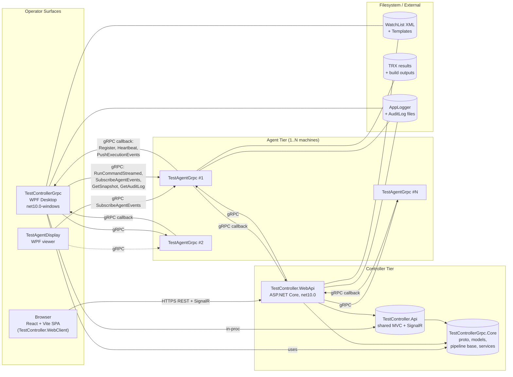
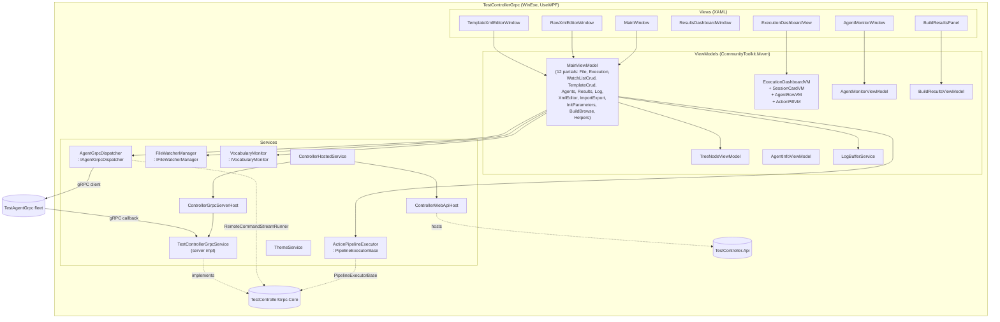
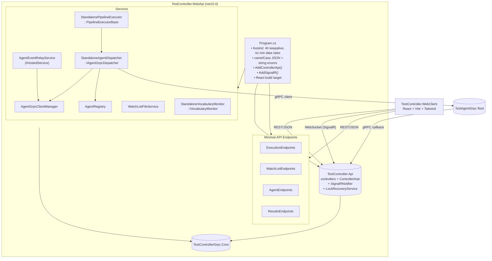
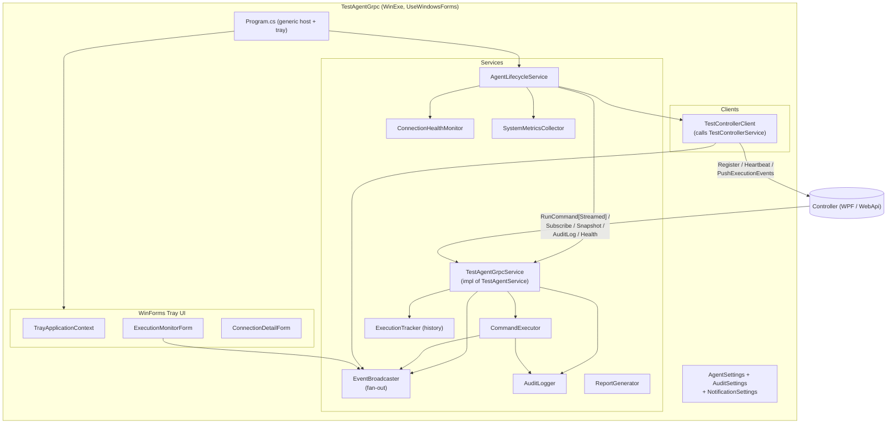
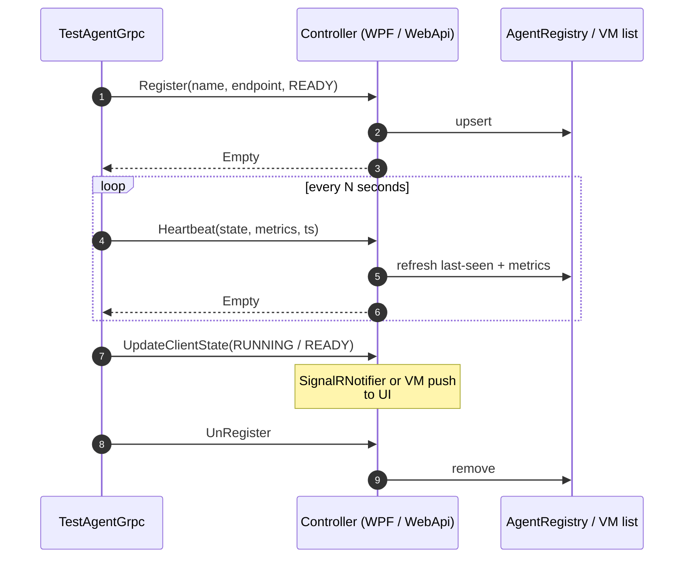
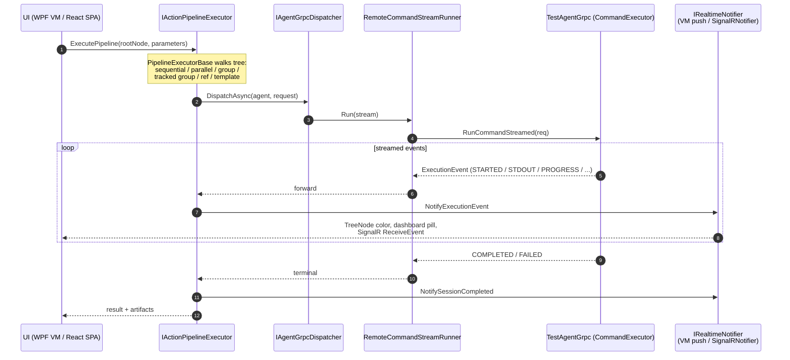
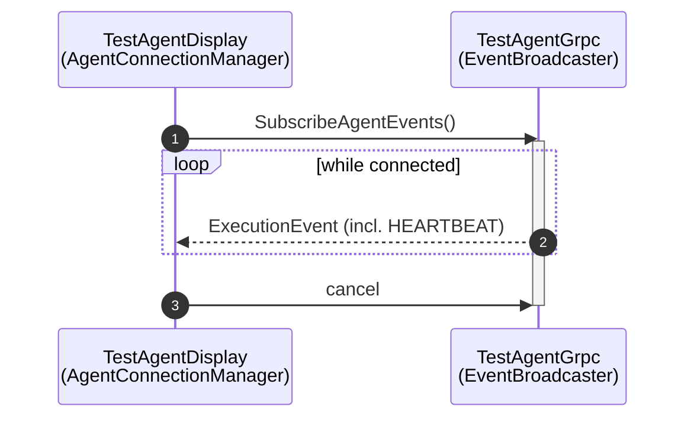
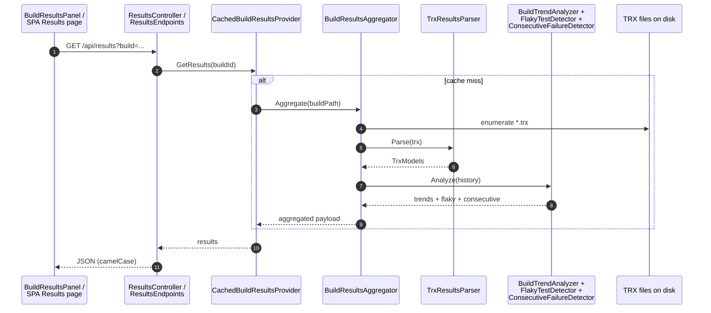
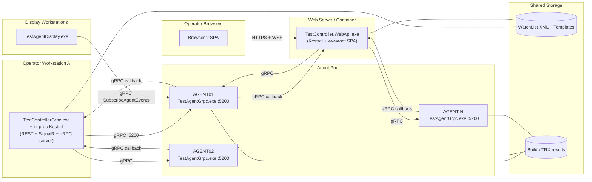

# TestAgentSolution — System Design & Architecture Diagrams

> **Status:** Current state on `master` (post .NET 10 upgrade)
> **Target framework:** `net10.0` / `net10.0-windows`
> **Companion doc:** see [`ARCHITECTURE.md`](./ARCHITECTURE.md) for the full narrative; this file focuses on **renderable diagrams** (Mermaid) and a concise system-design summary.

---

## 1. Solution at a glance

The system is a **distributed test-orchestration platform** with two operator-facing surfaces backed by a shared API kernel and a fleet of remote agents.

| Project | TFM | Output | Role |
|---|---|---|---|
| `TestControllerGrpc.Core` | `net10.0` | Library | Shared kernel: proto contract, domain models, `PipelineExecutorBase`, `RemoteCommandStreamRunner`, event aggregator, build-results pipeline, interfaces (`IAgentGrpcDispatcher`, `IActionPipelineExecutor`, `IVocabularyMonitor`, `IRealtimeNotifier`, `IFileWatcherManager`, `IAppLogger`). |
| `TestController.Api` | `net10.0` | Library | Shared ASP.NET Core surface: MVC controllers (`Execution`, `WatchList`, `Agents`, `Results`, `Health`), `ControllerHub` (SignalR), `SignalRNotifier`, `LockRecoveryService`, `RequestLoggingMiddleware`, `AddControllerApi()` extension. |
| `TestControllerGrpc` | `net10.0-windows` (WPF) | WinExe | Desktop controller — WPF UI + in-process Kestrel hosting the shared API + gRPC server. Owns `MainViewModel` (12 partials), `ActionPipelineExecutor`, `AgentGrpcDispatcher`, `VocabularyMonitor`, dashboards. |
| `TestController.WebApi` | `net10.0` | Exe | Web controller — Kestrel hosting shared API + SignalR + React SPA from `wwwroot`. Standalone implementations: `StandaloneAgentDispatcher`, `StandalonePipelineExecutor`, `StandaloneVocabularyMonitor`, `AgentRegistry`, `AgentEventRelayService`. |
| `TestController.WebClient` | — | Vite/React SPA | Browser UI; built via MSBuild targets and copied into the WebApi `wwwroot`. |
| `TestAgentGrpc` | `net10.0-windows` | WinExe (tray) | Agent: gRPC server (`TestAgentService`), `CommandExecutor`, `EventBroadcaster`, `AuditLogger`, `SystemMetricsCollector`, `ConnectionHealthMonitor`, WinForms tray UI; gRPC client back to controller (`TestControllerClient`). |
| `TestAgentDisplay` | `net10.0-windows` (WPF) | WinExe | Lightweight viewer subscribing directly to agents via `SubscribeAgentEvents`. |
| `TestControllerGrpc.Tests` / `TestController.WebApi.Tests` | `net10.0` | Test | Unit/integration tests. |

### Key design pillars

1. **Single proto contract** (`TestControllerGrpc.Core/Protos/test_agent.proto`) with two services: `TestControllerService` (hosted by controllers) and `TestAgentService` (hosted by agents).
2. **Two pipeline executors, one base** — `ActionPipelineExecutor` (WPF) and `StandalonePipelineExecutor` (WebApi) both inherit `PipelineExecutorBase` so orchestration logic (sequential/parallel, ref/template expansion, group / tracked group, snapshot-isolated retry, deep-clone) is shared.
3. **Two dispatchers, one interface** — `IAgentGrpcDispatcher` is implemented by both hosts; both delegate streaming through `RemoteCommandStreamRunner`.
4. **Pluggable real-time notification** — `IRealtimeNotifier` is implemented as in-process VM push for WPF and `SignalRNotifier` over `ControllerHub` for the web.

---

## 2. Container view (C4-style)

---

## 3. gRPC contract surface

```mermaid
flowchart TB
    subgraph TCS["TestControllerService — hosted by Controller"]
        direction TB
        R1["Register(TestAgentRef)"]
        R2["UnRegister(TestAgentRef)"]
        R3["UpdateClientState(TestAgentRef)"]
        R4["PushExecutionEvents(stream ExecutionEvent)"]
        R5["Heartbeat(HeartbeatRequest)"]
    end

    subgraph TAS["TestAgentService — hosted by Agent"]
        direction TB
        A1["GetState"]
        A2["RunCommand"]
        A3["GetLastExitCode"]
        A4["GetLastError"]
        A5["TerminateExecution"]
        A6["RunCommandStreamed ? stream ExecutionEvent"]
        A7["SubscribeAgentEvents ? stream ExecutionEvent"]
        A8["GetExecutionHistory"]
        A9["GetAgentSnapshot"]
        A10["GetAuditLog"]
        A11["GetConnectionHealth"]
    end

    Ctrl[("Controller<br/>(WPF / WebApi)")] --> TAS
    Agent[("TestAgentGrpc")] --> TCS
```

`ExecutionEvent` carries: `execution_id`, `agent_name`, `event_type` (QUEUED/STARTED/STDOUT/STDERR/PROGRESS/COMPLETED/FAILED/TERMINATED/STATE_CHANGED/HEARTBEAT), output payload, exit code, and `ResourceMetrics`.

---

## 4. WPF host — TestControllerGrpc internals

---

## 5. Web host — TestController.WebApi internals

---

## 6. Agent — TestAgentGrpc internals

The agent is **both** a gRPC server and a gRPC client — server for command dispatch and queries; client for registration, heartbeat, and event push.

---

## 7. Runtime flows

### 7.1 Registration + heartbeat

### 7.2 Pipeline execution (streamed)

### 7.3 Direct event subscription (TestAgentDisplay)

### 7.4 Build results aggregation

---

## 8. Deployment topology

Either controller can run alone; both use the same `TestController.Api` library, differing only in DI-injected implementations of `IAgentGrpcDispatcher`, `IActionPipelineExecutor`, `IVocabularyMonitor`, and `IRealtimeNotifier`.

---

## 9. Cross-cutting concerns

| Concern | Implementation |
|---|---|
| **Logging** | `IAppLogger` / `AppLogger` (file-based per host) + `RequestLoggingMiddleware`; agent-side `AuditLogger`. |
| **Real-time push** | `IRealtimeNotifier` — WPF in-process VM push vs `SignalRNotifier` over `ControllerHub`. |
| **Locking** | `AgentLockManager` + `AgentLockEvents` (Core) + `LockRecoveryService` (Api) prevent two pipelines acquiring the same agent. |
| **Event bus** | `EventAggregator` + `EventAggregatorEvents` (Core). |
| **Resilience** | `Polly.Core` on the WPF dispatcher path; widened Kestrel limits for long runs. |
| **Config** | `appsettings.json` (controllers), `AgentSettings` / `AuditSettings` / `NotificationSettings` (agent). |
| **Theming / icons** | `ThemeService`, `SvgIconControl`, `Svg.Skia`. |
| **XML editing** | `AvalonEdit` + `XmlSyntaxHighlighting.xshd`. |
| **CI** | `.github/workflows/build.yml` builds on `master`. |
| **Testing** | `TestControllerGrpc.Tests` + `TestController.WebApi.Tests`. |

---

## 10. Where to look in code

| Concept | Entry point |
|---|---|
| gRPC contract | `TestControllerGrpc.Core/Protos/test_agent.proto` |
| Pipeline base | `TestControllerGrpc.Core/Services/PipelineExecutorBase.cs` |
| WPF pipeline | `TestControllerGrpc/Services/ActionPipelineExecutor.cs` |
| WebApi pipeline | `TestController.WebApi/Services/StandalonePipelineExecutor.cs` |
| WPF dispatcher | `TestControllerGrpc/Services/AgentGrpcDispatcher.cs` |
| WebApi dispatcher | `TestController.WebApi/Services/StandaloneAgentDispatcher.cs` |
| Stream runner | `TestControllerGrpc.Core/Services/RemoteCommandStreamRunner.cs` |
| Shared controllers | `TestController.Api/Controllers/*.cs` |
| SignalR hub | `TestController.Api/Hubs/ControllerHub.cs` |
| WPF host bootstrap | `TestControllerGrpc/Services/ControllerHostedService.cs`, `ControllerWebApiHost.cs`, `ControllerGrpcServerHost.cs` |
| WebApi bootstrap | `TestController.WebApi/Program.cs` |
| Agent service impl | `TestAgentGrpc/Services/TestAgentGrpcService.cs` |
| Agent command exec | `TestAgentGrpc/Services/CommandExecutor.cs` |
| Agent ? controller client | `TestAgentGrpc/Clients/TestControllerClient.cs` |
| Display viewer | `TestAgentDisplay/Services/AgentConnectionManager.cs` |
| Build results | `TestControllerGrpc.Core/Services/BuildResultsAggregator.cs`, `CachedBuildResultsProvider.cs` |
