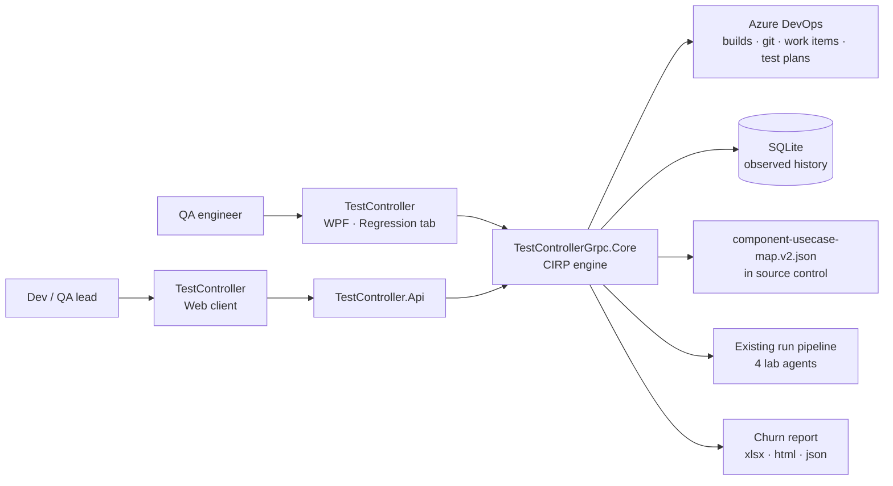
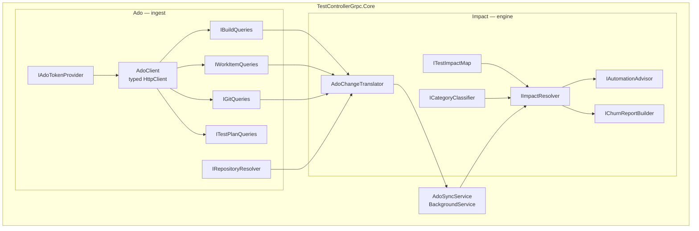
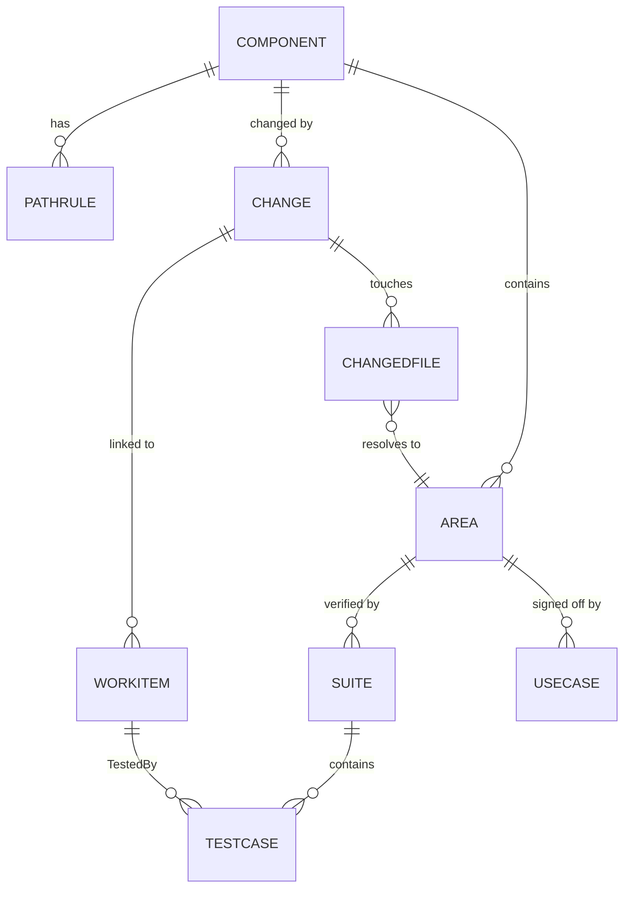
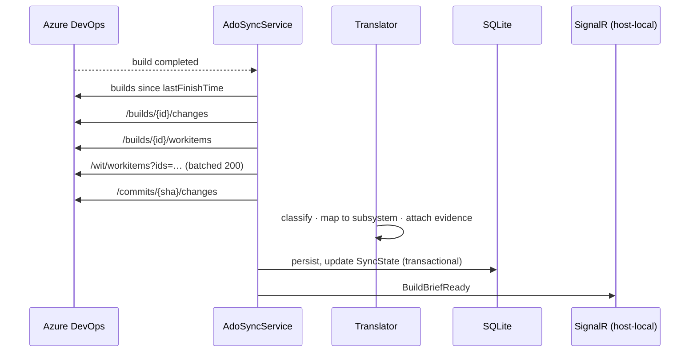
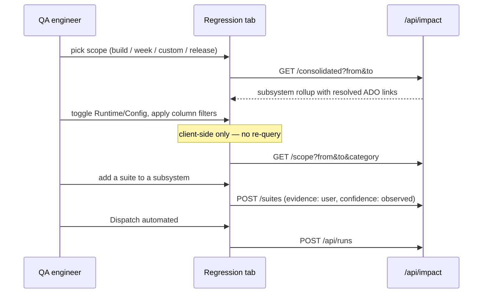

# Feature Architecture — Change Impact & Regression Planning

**Feature ID** CIRP
**Status** Approved for implementation
**Owner** Vinod Kumar
**Platform** TestAgentSolution
**Model version** 2.0 (`docs/impact/component-usecase-map.v2.json`)

**Companion documents**
`ImpactModel-Standard-Structure.md` · `Azure-DevOps-Integration-Guide.md` · `RegressionTab-UI-Spec.md` · `Copilot-Prompts-AdoIntegration.md`

---

## 1. Problem

A QA engineer receives several builds a day and has to answer three questions before testing anything: what changed, what might that break, and what should I run. Today those answers come from two artefacts that cannot talk to each other.

`vobs.csv` is a standing declaration of what each component *should* be tested for. One row per component, colon-delimited, hand-maintained, unchanged between releases. No evidence behind any of it.

The code churn workbook is evidence of what a specific change *was* tested with. Thirty-six sheets, re-authored from scratch every release, emailed to leads, then discarded.

The first has no evidence. The second has no memory. Neither can answer *this component changed again — what did we run last time, and did it find anything?*

Measured against the current data, the cost is concrete:

- A single build produces **59 change records, 9 of which are code**. The rest is bot version stamping and content.
- **24 of 46 changes** in SP2023R2SP1P03 named no test case at all.
- **26 of 41 subsystems** have no test suite mapped to them.
- **2 of 40 use cases** have automation behind them.
- Building the workbook is manual effort repeated every release, and the effort is thrown away each time.

## 2. Goals

**In scope**

1. Ingest build, commit, work item and file data from Azure DevOps automatically on build completion.
2. Roll changes up to subsystem level and categorise them Runtime or Config.
3. Recommend a regression plan split into automated suites and manual suites, scoped by build, week, custom range or release.
4. Let a QA engineer correct and extend the mapping in place, and have that correction persist as evidence.
5. Generate the churn report — including the legacy workbook layout — with no manual step.
6. Surface coverage gaps as first-class output rather than as absence.

**Explicitly not in scope**

- Executing tests. CIRP produces run requests; the existing run pipeline executes them.
- Replacing `vobs.csv` as a source. It becomes one input among several.
- File-level impact granularity beyond `pathRules`. Subsystem is the unit.
- Automated test authoring. CIRP identifies where automation is missing; people write it.
- Solving the run-queue gap. CIRP will *increase* pressure on it (see §10).

## 3. Guiding principles

**Every edge carries evidence and a confidence.** `assumed` (someone drew it), `declared` (`vobs.csv`), `observed` (here is the pull request). A declaration made in 2023 and never revisited is indistinguishable from a fact unless the model records which it is.

**Observed beats declared, and the conflict is logged.** Never silently overwritten.

**Unmapped never resolves to "nothing to run."** It resolves to an escalation. A component with an empty mapping that reports a clean impact analysis is worse than no analysis.

**Never guess an identifier.** A wrong repository id produces a link that 404s, and a Changes column where links sometimes fail stops being clicked within a week.

**The map is filled by the person who already knows the answer, at the moment they are looking at the change.** Nobody will sit down and author 93 edges as a project. Everybody will type four keystrokes while deciding what to run today.

## 4. Context

Both hosts consume the same Core engine through their own DI registrations. No cross-process singleton, no notification bridge — consistent with the platform keystone. Impact resolution is pure computation over a loaded map, so both hosts can do it independently and correctly.

## 5. Containers and components

| Component | Responsibility | Notably does not |
|---|---|---|
| `IAdoTokenProvider` | Produce an auth header | Know which host it runs in |
| `AdoClient` | HTTP, retry, rate-limit awareness, logging | Interpret payloads |
| `I*Queries` | Return Core domain types | Expose DTOs upward |
| `IRepositoryResolver` | Component → repo id, from the API | Guess a name |
| `AdoChangeTranslator` | ADO shapes → v2 model, with evidence | Any I/O, any clock |
| `ITestImpactMap` | Load, validate, query the graph | Mutate after load |
| `ICategoryClassifier` | Runtime / Config / Both / Unclassified + confidence | Hide low confidence |
| `IImpactResolver` | Window + filters → `RegressionScope` | Dispatch anything |
| `IAutomationAdvisor` | Rank automation candidates | Author tests |
| `IChurnReportBuilder` | xlsx / html / json from one model | Re-query ADO |
| `AdoSyncService` | Incremental ingest, host-local events | Serve requests |

## 6. Data model

**Split storage, deliberately.** Node definitions — Component, Area, UseCase, Suite, pathRules — stay in `component-usecase-map.v2.json` in source control, because a wrong mapping is a *review* problem before it is a database problem and a JSON file diffs in a pull request. Observed history — Change, WorkItem, ChangedFile, SyncState — goes to SQLite, because it accumulates and must be queryable across releases for the weekly and custom scopes to work over months.

**Identifier conventions.** Component: canonical PascalCase with `aliases[]` (the workbook says `AAMXCore`, `vobs.csv` says `AAMxCore` — without aliases these are two components and every join silently drops rows). Area: `<Component>/<AreaSlug>`. UseCase: `UC` + at least three digits, zero-padded. **Suite: the test case id with its trailing case number removed** — `FR1359724.WP.IO.Scaling.TCS001` yields suite `FR1359724.WP.IO.Scaling`. Your naming convention already encodes the hierarchy; the parser reads it rather than imposing a new one.

## 7. Key flows

### Build completion → brief

An immutable completed build is fetched exactly once. Re-runs cost near-zero API calls.

### Engineer opens the Regression tab

**The filtering boundary is architectural, not cosmetic.** Scope and date range hit the server. Category toggles, quick filters and column filters operate on already-fetched data. Cross that line and every keystroke in a filter box becomes an API call.

## 8. Architecture decisions

**ADR-01 — `HttpClient` and hand-written DTOs, not `Microsoft.TeamFoundationServer.Client`.** Eight endpoints are needed. The SDK offers typed clients but pulls a large legacy dependency graph that has historically lagged new .NET releases, and the target is .NET 10. *Rejected:* the SDK. *Cost:* DTOs must be regenerated if ADO changes a response shape — mitigated by fixture-based tests.

**ADR-02 — DTOs are generated from captured fixtures, never from documentation.** Optional fields, casing and nesting differ from the docs in practice. A DTO built from documentation compiles and then silently deserialises nulls.

**ADR-03 — Delegated auth in WPF, client credentials in the web host, behind one seam.** The engineer's own ADO permissions apply in the desktop app, so the links they click resolve to things they can open and the audit trail names a person. The service acts as itself for scheduled work. `IAdoTokenProvider` makes the swap a DI line. *Rejected:* a single shared service account for both — loses per-user audit and per-user permission scoping.

**ADR-04 — Entra tokens, PAT only as a scaffold.** Microsoft's guidance is explicit that PATs are for prototyping; Azure DevOps OAuth 2.0 is deprecated with removal planned for 2026. A scoped PAT in a credential store is acceptable through Phase C and must not survive Phase E.

**ADR-05 — `/builds/{id}/changes` replaces build-log scraping.** The existing `CompareBuildsForDiff` reconstructs the inter-build commit set by regex-matching ANSI-coloured console output with hardcoded character offsets. The API returns it directly. Retire the scraper after verifying against a build whose answer is already known. *This is the single largest reduction in fragility in the feature.*

**ADR-06 — Repository ids come from `_apis/git/repositories`, never from a pattern.** Only two aliases are known (`SysObj`, `aabootstrap`); the remaining 33 are guesses. Unresolved returns null and is reported on the coverage endpoint.

**ADR-07 — Node definitions in source control, observed history in SQLite.** See §6.

**ADR-08 — Category is derived, editable, and carries a confidence.** Runtime versus Config determines whether a deployed Galaxy is required — a real scheduling constraint, not a label. Keyword classification over file paths and subsystem names gets `Lmx` right and `GlobalHeder.cs` wrong. **Low confidence must be visible**; if an engineer cannot see the machine was unsure, they will trust a wrong classification.

**ADR-09 — Unmapped produces an escalation, never an empty selection.** Hard rule in `IImpactResolver`, covered by test.

**ADR-10 — Estimates are labelled as estimates until measured.** The current 12-minutes-per-suite and 25-minutes-per-manual figures are invented. Real durations come from TRX output. Until then the column says estimate and nobody schedules a shift on it.

## 9. Cross-cutting

**Security.** No secret in source, config or script — credentials come from an injected store reading Windows Credential Manager, an environment variable, or a certificate by thumbprint. PAT scopes limited to Build (Read), Code (Read), Work Items (Read), Test Management (Read). Auth headers and token provider output are never logged. *The PAT currently hardcoded in `GetBuildChanges.ps1`, `GetBuildChanges_OMI.ps1` and `test1.ps1` must be revoked and git history checked before Phase B begins.*

**Resilience.** Retry 429 and 5xx honouring `Retry-After`; read `X-RateLimit-Remaining` and throttle proactively. Never retry 401 or 403 — those are configuration problems and retrying hides them. Backfill and incremental sync use separate code paths; their traffic profiles are nothing alike.

**Degradation.** If Azure DevOps is unreachable, serve cached data with a visible "data as of {time}". A blank grid reads as a bug; stale data with a timestamp is usable.

**Observability.** Every ADO request logged with URL and correlation id through `IAppLogger` — when a 2am scheduled run fails, the URL is the whole diagnosis. Per-sync summary: definitions checked, builds ingested, API calls made, duration. Prometheus counters for ingest volume, rate-limit hits, unresolved repositories, and escalations raised.

**Testing.** Translator and resolver fully unit-tested against fixtures with zero network. One integration test asserts the real map validates clean. Required cases: unmapped raises escalation and never an empty plan; cycle-safe dependency traversal; merge commit with empty change list is normal not an error; first build of a definition has no predecessor; unknown work item type passes through as `other` rather than being dropped; repository resolution failure returns null.

## 10. Delivery phases

| Phase | Delivers | Gate |
|---|---|---|
| 0 | PAT revoked, history checked, replacement stored outside source | `git grep` clean |
| 1 | PowerShell spike; fixtures captured for both projects | Builds, commits, work items retrieved by hand |
| 2 | Auth seam; PAT and Entra providers | Header test passes, no secret tracked |
| 3 | `AdoClient`, query surfaces, resilience | Real data retrieved with a scoped credential |
| 4 | Translator, classifier, repository resolver | One build maps end to end, spot-checked in the ADO UI |
| 5 | Persistence, incremental sync, endpoints | Restart re-fetches nothing |
| 6 | Regression tab (R9 → R1/R2 → R7/R8 → R11–R13 → R10 → R5/R6/R14 → editing) | Tab populated, links open, edits persist |
| 7 | Churn report generation incl. legacy workbook layout | Scheduled generation replaces the manual workbook |
| 8 | Automation advisor and effectiveness feedback | Selected-vs-caught recorded per run |

Phases 3 and 4 are the bulk of the code. Phase 2 is short but involves other people — **start the Entra app registration and the "add service principal as an ADO org user" request in parallel with Phase 1**, because waiting on an admin is the likeliest stall.

## 11. Gap scoreboard

| Gap | Severity | Note |
|---|---|---|
| 26 of 41 subsystems have no suite mapped | **Blocker for value** | The feature surfaces this; people close it |
| 2 of 40 use cases automated | High | This *is* the automation backlog, now countable |
| 33 of 35 repository names are guesses | High | ADR-06 resolves; until then links are provisional |
| Suite id does not resolve to a runnable invocation | High | `FR829777.EACRuntime` must map to an assembly, filter or playlist before *Must run* can dispatch rather than advise |
| Durations unmeasured | Medium | ADR-10 |
| Run queue returns 409 when busy, no queuing | Medium | CIRP produces *more* run requests; this gap gets worse, not better |
| Work item type strings unverified | Medium | Read from a live response, not assumed |
| Dependency edges partly hand-seeded | Medium | 20 of 72 observed from shared work items; the rest assumed |
| No effectiveness feedback loop | Medium | Phase 8; without it the map decays within two releases |
| Canonical component spellings unratified | Low but blocking | This becomes a join key — needs a named owner's decision |

## 12. Open questions

1. Who owns the canonical component spelling list, and by when? (`AAMxCore`, `AASysObjects`, `MagellanProduct`, `Cybersecurity`, `AACategoryPkg` are my proposals.)
2. Does a suite id resolve to something runnable, and where does that mapping live?
3. `ArchVisDev` appears in the churn workbook and in no other source — real component or an abandoned sheet?
4. `MagellanProduct` logId is 13 in one CSV and 14 in another.
5. Should manual use cases block a run plan or sit beside it as an advisory checklist?
6. Who receives escalations, and what makes one overdue? Without an owner and a due state, the red column becomes a number people scroll past.
7. Is the legacy workbook a bridge to be deprecated, or a permanent deliverable that deserves proper tests?
