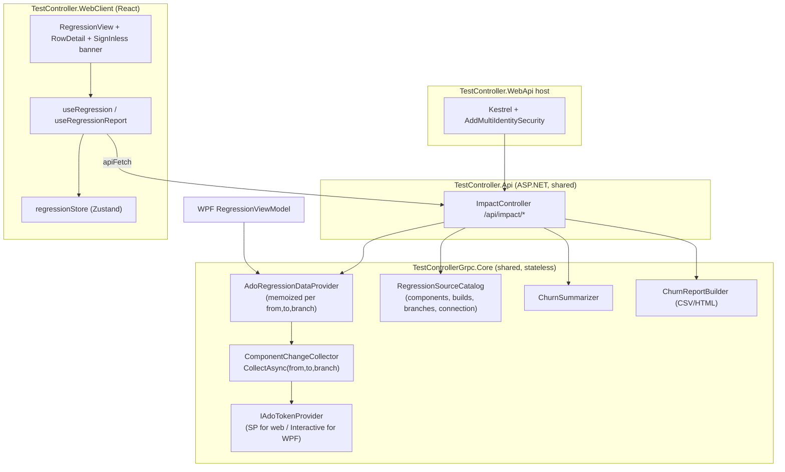

# WebClient Parity Architecture — Regression / ADO Feature

**Status:** Design → Implementation
**Goal:** Everything the WPF Controller's Regression tab does against Azure DevOps must also be available in the React WebClient, driven by the **same shared Core ADO logic**, redesigned so it is safe for a multi-user web host.

> This document is the authoritative inventory + design. It intentionally lists **every** capability so nothing is dropped in the port. Cite it by section when implementing.

---

## 1. Why a redesign is needed

The Core ADO ingest (`TestControllerGrpc.Core/Ado/*`) is already shared by both hosts — the WPF Controller and the standalone `TestController.WebApi` both call `AddAdoRegressionIngest()`. The data pipeline (collector → provider → catalog → report/summary) is stateless **except one flaw**:

- **`AdoOptions.ActiveBranch` is mutated at runtime** (`RegressionSourceCatalog.SetActiveBranch`) to drive the branch switcher. On the single-user WPF desktop that's fine. On the web host it is a **shared-mutable-state hazard** — one user's branch selection would leak into every concurrent request.

**Redesign principle:** make the read path **fully parameterized and stateless**. The branch (like `from`/`to`) becomes a per-call argument threaded through the provider and collector. No request mutates shared options.

Everything else in Core (`ComponentChangeCollector`, `ChurnSummarizer`, `ChurnReportBuilder`, `RegressionSourceCatalog` read methods) is already pure/shared and needs no change.

---

## 2. Complete functionality inventory (WPF today → must exist in Web)

Grouped by concern. **Data** items already flow through `SubsystemRow` JSON — the web just needs to model + render them. **Action** items need new API endpoints.

### 2.1 Scope & timeline
| Capability | Source | Web port |
|---|---|---|
| Scope presets: Build / Weekly / Custom / Release | VM `SelectScope` | Client-side date math (exists) |
| From/To date range + Apply | VM `From`/`To`/`ApplyRange` | Client (exists) |
| **Timeline aggregation** — a wider window aggregates churn across *all* builds in range | `ComponentChangeCollector` (Core) | **Already server-side** — web benefits automatically |
| Latest-build indicator on the Build button | VM `LatestBuildText` | Derive from rows or `/summary` |

### 2.2 Grid rows (`SubsystemRow`)
| Column | Field | Notes |
|---|---|---|
| Category badge | `category` (Runtime/Config/Both/Unclassified) | + left-border colour |
| **Repositories** (merged Component + Repo) | `component` + `repository` (`repositoryUrl` link) | `Component (Repo→link)` |
| **Subsystems** | `solutionNames` (.sln under `/src`) | NEW field to model |
| Files modified (preview + total) | `filesModified`, `totalFilesModified` | |
| Summary preview | `changes[0].summary` | |
| Changes label | count of PR / commit / auto | derived |
| Risk | `riskTier` (build result) | |
| Latest OK build (link) | `latestSuccessfulBuild`, `latestSuccessfulBuildUrl` | NEW fields to model |
| Automation / Manual suites | `automatedSuites`, `manualSuites` | advisory |
| Estimate | `estimatedMinutes`, `isEstimate` | |
| Default branch | `defaultBranch` | NEW field to model |
| Build number / finished | `buildNumber`, `buildFinishedUtc`, `buildResult` | |

### 2.3 Row detail (expand / collapse)
| Item | Field / source | Web port |
|---|---|---|
| Expand/collapse per row + "hide details" | VM `IsExpanded` | Client state |
| **Component AI summary** | `ChurnSummarizer.SummarizeComponent` | `/summary` per component OR compute client-side is not possible (needs Core) → include on row or endpoint |
| **Functional tests to execute** | `useCases` + `regressionAreas` | Client join |
| Build info / repo info line | `buildNumber`, `repository`, `defaultBranch` | Client |
| **Changes — sorted oldest→newest + timestamp** | `changes` sorted by `observedUtc` | Client sort + render `url` link |
| **Syncup highlight** | `changes[].kind == 'Automated'` | Client style |
| **Work items grouped by type** (User Stories / Bug / IMS / Others), each with **created date**, ordered | `workItems[].kind` + `createdUtc` | Client group; `createdUtc` NEW field |
| **Modified files with repo header + hierarchy + links** | `filesModified` + per-commit `changes[].filePaths` | Client build links: `{repositoryUrl}?path={p}&version=GC{commit}|GB{branch}` |

### 2.4 Filters & toggles (client-side over fetched rows)
- Runtime / Config category toggles.
- **Human-only** (hide Automated build-tool changes; drop rows with no human change).
- Work-item filters: **Bug / Story / IMS** (OR).
- Component picker (narrow to one component).
- **Branch switcher** — server-side (affects the scan) → drives a re-fetch with `?branch=`.
- Build picker (inspect one build of a component) — server-side endpoint.

### 2.5 Analytics & reporting
| Capability | Source | Web port |
|---|---|---|
| **Scope AI summary** (headline + highlights + narrative) | `ChurnSummarizer.Summarize` | `/summary` endpoint |
| **Export CSV** | `ChurnReportBuilder.BuildCsv` | `/report?format=csv` (download) |
| **Export HTML** | `ChurnReportBuilder.BuildHtml` | `/report?format=html` (download / preview) |
| **Email report** (HTML body + CSV attachment) | WPF `RegressionReportMailer` | `/email` endpoint (web SMTP) |
| Impacted Functionality / Test Use Cases columns in report | `ChurnReportBuilder` | already in report output |
| Connection status (org/project/mode/credential) | `RegressionSourceCatalog.GetConnectionInfo` | `/connection` endpoint |
| Plan panel (Runtime/Config subsystems, suites, gaps, parallel duration) | `/scope` | exists |
| Sync status (state / map version / unresolved repos) | `/sync-status` | exists |

### 2.6 Auth (host-specific — **not** ported literally)
- WPF: interactive Microsoft/Entra sign-in dialog (`InteractiveTokenProvider`), because the desktop acts as the signed-in engineer.
- Web: the host authenticates to ADO as its **service principal** (`ServicePrincipalTokenProvider`); the *user* authenticates to the web host via the existing `AddMultiIdentitySecurity()` (NTLM/negotiate + API key). **No interactive ADO sign-in UI in the web** — the connection banner reflects the SP credential state instead. (ADR-03.)

---

## 3. Target system architecture

- **One engine, two front doors.** The API and the WPF VM both consume the same Core services. The web adds no ADO logic of its own — it only calls the API.
- **Stateless reads.** Every query carries `from`, `to`, `branch`. The provider's 60s memo is keyed by `(mode, branch, from, to)`.

---

## 4. Core changes (Phase 1)

1. **`IRegressionDataProvider`** — add `string? branch` to the read methods:
   - `GetConsolidatedAsync(DateOnly from, DateOnly to, string? branch, CancellationToken)`
   - `GetScopeAsync(DateOnly from, DateOnly to, RegressionCategoryKind? category, string? branch, CancellationToken)`
   - (keep existing signatures as overloads that pass `branch: null` so nothing breaks.)
2. **`ComponentChangeCollector.CollectAsync(from, to, branch, ct)`** — use the `branch` argument instead of `_options.ActiveBranch`.
3. **`AdoRegressionDataProvider`** — thread `branch` into `FetchRowsAsync`; memo key `{mode}|{branch}|{from}|{to}` (already includes branch — switch to the parameter).
4. **`RegressionSourceCatalog`** — keep `GetBranchesAsync` (live from build source branches ∪ config). **Remove `SetActiveBranch`** and `AdoOptions.ActiveBranch` (no longer needed).
5. **WPF** — `RegressionViewModel` passes its `SelectedBranch` as the `branch` argument on every load; delete the `SetActiveBranch` call.

No change to `ChurnSummarizer`, `ChurnReportBuilder`, `ComponentBuildInfo`, DTOs, or the categorizer.

---

## 5. API contract (Phase 2) — `/api/impact/*`, `[Authorize(User)]`

| Method + route | Purpose | Response |
|---|---|---|
| `GET /consolidated?from&to&branch` | Grid rollup | `ConsolidatedImpact` |
| `GET /scope?from&to&category&branch` | Plan panel | `RegressionScope` |
| `GET /sync-status` | Status bar | `RegressionSyncStatus` |
| `GET /connection` | Connection banner | `RegressionConnectionInfo` |
| `GET /components` | Component picker | `RegressionComponentRef[]` |
| `GET /components/{defId}/builds` | Build picker | `RegressionBuildRef[]` |
| `GET /components/{defId}/builds/{buildId}` | One build's impact | `SubsystemRow` |
| `GET /branches` | Branch switcher | `string[]` |
| `GET /summary?from&to&branch` | Scope AI summary | `ChurnSummary` |
| `GET /report?from&to&branch&format=csv\|html` | Download report | file (text/csv or text/html) |
| `POST /email` `{ from,to,branch,recipients }` | Email report | `{ sent, recipients }` |
| `POST /suites` | Inline suite edit (advisory) | `204` |

- New DTOs are the existing Core records — no new shapes to invent. `report` returns a `FileContentResult`; `summary` returns `ChurnSummary`.
- `report`/`email`/`summary` build a `ChurnReport` from `GetConsolidatedAsync(from,to,branch)` rows, then call the Core builder/summarizer (already registered).
- `email` uses the web host's `BuildResultsConfig` SMTP (same path as `ResultsEndpoints`).

---

## 6. WebClient architecture (Phases 3–4)

### 6.1 Types (`src/types/api.ts`)
Extend `SubsystemRow` with the missing fields: `repository?`, `repositoryUrl?`, `defaultBranch?`, `buildResult?`, `latestSuccessfulBuild?`, `latestSuccessfulBuildUrl?`, `solutionNames?`. Extend `RegressionChangeRef` with `url?`. Extend `RegressionWorkItemRef` with `createdUtc?`. Add `RegressionConnectionInfo`, `RegressionComponentRef`, `RegressionBuildRef`, `ChurnSummary`.

### 6.2 State (`src/stores/regressionStore.ts`)
Add: `connection`, `components`, `branches`, `selectedBranch`, `summary`, plus UI filter state already partly present (`showRuntime`, `showConfig`) and new `hideAutomated`, `filterBug/Story/Ims`, `selectedComponent`, `expandedRows`.

### 6.3 Hooks
- `useRegression` — `loadAll(from,to,branch)` (consolidated+scope+sync+connection+summary), plus `fetchBranches`, `fetchComponents`, `fetchBuilds`.
- `useRegressionReport` — `downloadReport(format)`, `emailReport(recipients)`.

### 6.4 Components (`src/components/regression/`)
- `RegressionView` (toolbar ribbon-equivalent: scope, timeline, Runtime/Config, Human-only, WI filters, component picker, **branch picker**, refresh, export, email; connection banner; latest-build; R6 counters; plan panel; AI summary banner).
- `SubsystemRowItem` + `RowDetail` (component AI summary, functional tests, sorted changes w/ syncup highlight + timestamps + links, grouped work items w/ created dates, modified files w/ repo hierarchy + links, subsystems).
- All client-side filters mirror `RegressionViewModel.ApplyFilter` (human-only strips `Automated` changes and drops empty rows; counters reflect the visible grid).

### 6.5 Rendering rules (parity with WPF)
- Modified-file link: `${repositoryUrl}?path=${encodeURIComponent(path)}&version=GC${commitId}` (commit that touched it) else `GB${defaultBranch}`.
- Work-item groups order: User Stories, Bug, IMS, Others; within a group order by `createdUtc`.
- Changes: sort ascending by `observedUtc`; `Automated` rows get the amber highlight.
- Human-only default ON: drop `Automated` changes; recompute counts; hide rows with no remaining change.
- Repositories cell: `component (repository)` where the repository is an ADO link.

---

## 7. Security

- All `/api/impact/*` endpoints keep `[Authorize(Policy = User)]` (the shared `SecurityPolicies.User`).
- `/email` and `/report` are reads of already-authorized data; no new privilege.
- ADO credential = the host's SP (never exposed to the browser). The browser never sees a token; it only sees projected JSON + generated ADO deep-links.

---

## 8. Phased implementation plan + exit criteria

| Phase | Work | Exit criteria |
|---|---|---|
| **1 — Core** | Parameterize `branch`; drop `ActiveBranch`/`SetActiveBranch`; WPF passes branch | Core + WPF build 0 errors; WPF branch switch still works |
| **2 — API** | Add the 8 new endpoints; report/summary/email wiring | WebApi builds 0 errors; endpoints return expected JSON/files |
| **3 — Types** | Extend `api.ts` shapes | `npm run build` (tsc) passes |
| **4 — WebClient UI** | Full `RegressionView` + `RowDetail` + branch/filters/summary/export/email | `npm run build` passes; feature parity visually |
| **5 — Validate** | Manual pass against live ADO; adjust | Web grid matches WPF for the same window/branch |

---

## 9. Explicitly **not** ported (with rationale)

- **Interactive Microsoft sign-in dialog** — web authenticates ADO as a service principal (ADR-03). The web connection banner shows SP state; there is no per-user ADO browser sign-in in the web.
- **Real suite dispatch / manual assignment** — advisory-only in both clients until a suite-id→WatchItem-tag mapping exists (unchanged).
- **`AgentLockManager` / pipeline lock** — unrelated to this feature.

---

## 10. File touch list

**Core:** `IRegressionDataProvider.cs`, `AdoRegressionDataProvider.cs`, `ComponentChangeCollector.cs`, `RegressionSourceCatalog.cs`, `AdoOptions.cs` (remove `ActiveBranch`).
**API:** `TestController.Api/Controllers/ImpactController.cs` (expand).
**WPF:** `RegressionViewModel.cs` (pass branch; drop `SetActiveBranch`).
**WebClient:** `types/api.ts`, `stores/regressionStore.ts`, `hooks/useRegression.ts` (+ `useRegressionReport.ts`), `components/regression/RegressionView.tsx` (+ `RowDetail.tsx`).
