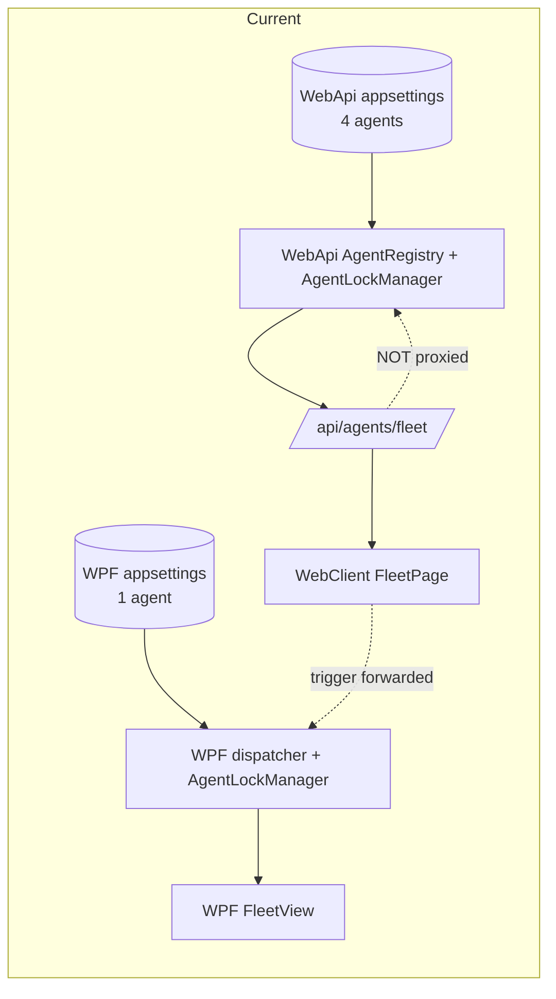
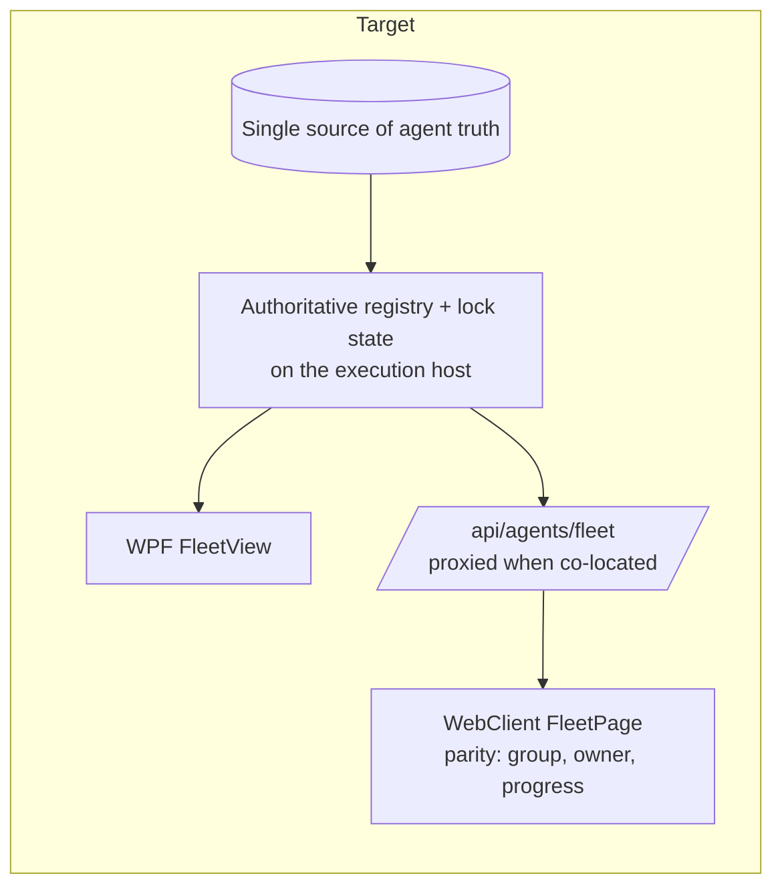

# ISSUE: Agent Registry & Fleet-View Inconsistency (WPF vs WebClient)

**Status:** Plan / not started
**Area:** Agent registry, fleet status, fleet pipeline view
**Hosts affected:** `TestControllerGrpc` (WPF Controller), `TestController.WebApi` (standalone host), `TestController.WebClient` (React)

---

## 1. Symptoms (reported)

1. **Different agent lists.** The WPF app and the WebClient show a *different set of agents*. The two `appsettings.json` files carry different static `"Agents"` arrays.
2. **Incorrect agent status.** Some agents show a status that does not reflect reality (e.g. "Healthy"/"Connected" when offline, or "Unknown").
3. **Fleet view divergence on trigger.** When a pipeline is triggered, the **WebClient Agent Fleet** does not match the **WPF Agent Fleet pipeline view** — the WPF view shows the agent busy with the running pipeline (owner, action, progress), while the WebClient shows it idle/unlocked (or vice-versa).

---

## 2. Root-Cause Analysis (verified)

### RC-1 — Two independent, statically-seeded agent registries

Each host seeds its own in-memory agent list from its **own** config file, with no sync:

- WPF: 1 agent — [TestControllerGrpc/appsettings.json](../../TestControllerGrpc/appsettings.json#L5) → `[ { "Name": "VinodJHist", ... } ]`
- WebApi: 4 agents — [TestController.WebApi/appsettings.json](../../TestController.WebApi/appsettings.json#L23) → `[ JVGR1, JVKPRI, JVKBAK, JVHIST ]`

WebApi loads them into [`AgentRegistry`](../../TestController.WebApi/Services/AgentRegistry.cs#L13) (`config.GetSection("Agents")`). The WPF host loads its own list into its dispatcher. The two registries never exchange data. The React fleet reads **WebApi's** registry only ([`GetFleet`](../../TestController.WebApi/Endpoints/AgentEndpoints.cs#L444)); the WPF fleet reads **WPF's** dispatcher. **→ different agent lists.**

The `VocabularyFile` (WatchList) paths also differ between the two configs, compounding the "different world" problem:
`C:\TestControllerService\WatchList.xml` (WPF) vs `C:\TestController\WatchLists.xml` (WebApi).

### RC-2 — Two different status sources that disagree (even within the WebApi host)

There are **two** agent-status code paths and they do not agree:

- `GET /api/agents` (shared [`AgentsController`](../../TestController.Api/Controllers/AgentsController.cs#L21)) reads `IAgentGrpcDispatcher.GetAgentHealth(name)`. In the WebApi host the dispatcher is [`StandaloneAgentDispatcher`](../../TestController.WebApi/Services/StandaloneAgentDispatcher.cs#L88), whose `GetAgentHealth` **hard-codes `IsHealthy = true`** for any registered agent. So this endpoint *always* reports "Healthy", regardless of reachability.
- `GET /api/agents/fleet` ([`GetFleet`](../../TestController.WebApi/Endpoints/AgentEndpoints.cs#L444)) reads `AgentEntry.Status`, which **is** updated to `Connected`/`Unreachable`/`Error` by the background [`AgentEventRelayService`](../../TestController.WebApi/Services/AgentEventRelayService.cs#L58) as it subscribes to each agent's gRPC event stream. These are gRPC-enum-derived strings (e.g. `AgentStateReady`), which is why the client carries a long pattern list in [`agentStatus.ts`](../../TestController.WebClient/src/lib/agentStatus.ts#L14).

Meanwhile the WPF fleet computes status from its **own** probe loop (`TestConnectionAsync` every ~5s) and circuit-breaker `AgentHealthState`. So three different status engines exist (WPF probe, WebApi dispatcher-always-healthy, WebApi relay). **→ inconsistent / incorrect status.**

### RC-3 — Fleet/lock state is NOT shared between hosts (the trigger mismatch)

This is the core of symptom #3.

- The [`ControllerProxyService`](../../TestController.WebApi/Services/ControllerProxyService.cs#L44) proxies **execution + dashboard sessions** to the WPF controller (`GetDashboardSessionsAsync`, `GetSessionsAsync`, `GetExecutionStatusAsync`, and execution **trigger/cancel** forwarding). In a co-located deployment the WPF controller is the single execution engine.
- But there is **no** proxy for `/api/agents/fleet`. The fleet endpoint always reads the WebApi host's **own** `AgentRegistry` + `AgentLockManager` + `ExecutionSessionManager`.

Consequence on trigger (co-located deployment):
1. React triggers → WebApi **forwards** the run to the WPF controller (per the execution-forwarding middleware).
2. The WPF controller executes and locks the agent in **WPF's** `AgentLockManager`, and the WPF fleet shows it busy with the pipeline (owner, action, progress).
3. WebApi's own `AgentLockManager` stays **empty** — it never ran the pipeline.
4. React fleet (reading WebApi's empty lock manager) shows the agent **idle/unlocked**. **→ WebClient fleet ≠ WPF fleet.**

Even in a non-co-located (standalone) deployment, the two fleet views differ in *shape*: WPF groups cards by session/pipeline with owner+role+action+progress; the WebClient renders a flat grid with status + lock flag only (no pipeline grouping, no progress).

### RC-4 — Fleet view feature parity gap (WPF richer than WebClient)

| Feature | WPF `FleetVM`/`FleetView` | WebClient `FleetPage` |
|---|---|---|
| Group by pipeline/session | Yes | No (flat grid) |
| Owner + role attribution | Yes (badge, role glyph) | `lockSource` only |
| Current action + progress % | Yes | No |
| Status source | local probe + circuit breaker | `AgentEntry.Status` via relay |
| Lock source | WPF `AgentLockManager` | WebApi `AgentLockManager` |

---

## 3. Current vs Target Architecture





---

## 4. Remediation Options

### Option A — Single source of agent config (low effort, fixes RC-1)
Stop maintaining two `"Agents"` arrays. Point both hosts at one shared agent-config source:
- Move the agent list into the shared WatchList/config the controller already owns, **or**
- Have the secondary host read the agent list from the controller at startup (the proxy already exists), **or**
- At minimum, make the two `appsettings.json` `"Agents"` arrays (and `VocabularyFile`) identical via deployment tooling.

### Option B — Proxy the fleet endpoint when co-located (medium effort, fixes RC-3)
Add `ControllerProxyService.GetFleetAsync()` and have `GetFleet` (or a thin middleware) **forward `/api/agents/fleet` to the WPF controller when `ControllerProxyUrl` is configured**, exactly like dashboard sessions/execution already do. This makes the WebClient fleet read the *same* registry + lock state the WPF fleet shows. Falls back to local registry when standalone.

### Option C — Unify status computation (medium effort, fixes RC-2)
- Fix [`StandaloneAgentDispatcher.GetAgentHealth`](../../TestController.WebApi/Services/StandaloneAgentDispatcher.cs#L88) to return real health derived from `AgentEntry.Status` / connectivity, instead of always `IsHealthy = true`.
- Normalize status vocabulary into one shared mapper used by `/api/agents`, `/api/agents/fleet`, the WPF fleet, and `agentStatus.ts`, so "Connected" / "AgentStateReady" / "Healthy" map to a single canonical enum.

### Option D — WebClient fleet parity (medium effort, fixes RC-4)
Bring `FleetPage` to functional parity with the WPF fleet: group by pipeline/session, show owner + role, current action, and progress — driven by the (now shared) fleet payload + existing session/lock SignalR events.

---

## 5. Recommended Approach

Do **B + C** first (they fix the *correctness* problems #2 and #3), then **A** (operational hygiene), then **D** (UX parity).

Rationale: B makes the WebClient read the authoritative fleet in the real (co-located) deployment, so the trigger mismatch disappears; C removes the "always Healthy" lie and unifies status; A prevents the lists drifting again; D closes the visual gap.

---

## 6. Phased Implementation Plan

### Phase 0 — Config unification (RC-1)
- **Goal:** Both hosts resolve the *same* agent list (and `VocabularyFile`).
- **Changes:**
  - Decide the single source of truth (recommend: the controller's config; the WebApi reads the list from the controller at startup via the existing proxy, or shares one config file via deploy tooling).
  - Update [deploy/](../../deploy) tooling / `Validate-DeployManifest.ps1` to assert the two `"Agents"` arrays and `VocabularyFile` match (or that the secondary host defers to the controller).
- **Exit criteria:** WPF and WebApi report the same agent set in Default mode on a co-located box.

### Phase 1 — Proxy the fleet when co-located (RC-3) ← highest impact
- **Changes:**
  - Add `ControllerProxyService.GetFleetAsync()` mirroring `GetDashboardSessionsAsync` ([ref](../../TestController.WebApi/Services/ControllerProxyService.cs#L44)).
  - In [`GetFleet`](../../TestController.WebApi/Endpoints/AgentEndpoints.cs#L444) (or a small forwarding shim): when `proxy.IsConfigured`, return the controller's fleet payload; else serve local registry. Preserve the `{ agents, lockVersion }` shape so the client/[`useFleetState`](../../TestController.WebClient/src/hooks/useFleetState.ts#L22) is unchanged.
  - Ensure the controller exposes an equivalent `/api/agents/fleet` (it shares `TestController.Api`; confirm the controller host maps the same endpoint or add it).
  - Make sure `AgentLocksChanged` / `AgentStatusChanged` SignalR events from the controller relay to the WebClient (the relay path already exists for execution events).
- **Exit criteria:** Trigger a pipeline from the WebClient on a co-located box → the WebClient fleet shows the agent locked to the same pipeline/owner the WPF fleet shows, and clears together on completion/cancel.

### Phase 2 — Unify + fix status (RC-2)
- **Changes:**
  - Replace the hard-coded `IsHealthy = true` in [`StandaloneAgentDispatcher.GetAgentHealth`](../../TestController.WebApi/Services/StandaloneAgentDispatcher.cs#L88)/`GetAllAgentHealth` with real status derived from `AgentEntry.Status` + last-checked recency.
  - Introduce one shared status mapper (canonical: `Online | Busy | Offline | Unknown`) consumed by `/api/agents`, `/api/agents/fleet`, the WPF fleet status logic, and [`agentStatus.ts`](../../TestController.WebClient/src/lib/agentStatus.ts#L14). Keep the gRPC-enum → canonical mapping in **one** place.
- **Exit criteria:** An offline agent shows "Offline" on **both** `/api/agents` and `/api/agents/fleet` and in both UIs; no endpoint reports a falsely-healthy agent.

### Phase 3 — WebClient fleet parity (RC-4)
- **Changes to** [`FleetPage.tsx`](../../TestController.WebClient/src/components/agents/FleetPage.tsx):
  - Group cards by pipeline/session (mirror WPF grouping).
  - Show owner + role (reuse the owner/role attribution already added this cycle) and current action + progress, sourced from the fleet payload + session SignalR events.
- **Exit criteria:** Side-by-side, the WebClient fleet and WPF fleet present the same grouping, owner/role, action, and progress for a running pipeline.

---

## 7. Files Likely Touched

| Phase | File | Change |
|---|---|---|
| 0 | [TestControllerGrpc/appsettings.json](../../TestControllerGrpc/appsettings.json) / [TestController.WebApi/appsettings.json](../../TestController.WebApi/appsettings.json) | single agent source / matching arrays |
| 0 | [deploy/Validate-DeployManifest.ps1](../../deploy/Validate-DeployManifest.ps1) | assert parity |
| 1 | [ControllerProxyService.cs](../../TestController.WebApi/Services/ControllerProxyService.cs) | add `GetFleetAsync()` |
| 1 | [AgentEndpoints.cs](../../TestController.WebApi/Endpoints/AgentEndpoints.cs#L444) | proxy `GetFleet` when configured |
| 1 | controller host fleet endpoint | ensure `/api/agents/fleet` available on the WPF host |
| 2 | [StandaloneAgentDispatcher.cs](../../TestController.WebApi/Services/StandaloneAgentDispatcher.cs#L88) | real `GetAgentHealth` |
| 2 | shared status mapper + [agentStatus.ts](../../TestController.WebClient/src/lib/agentStatus.ts) | one canonical mapping |
| 3 | [FleetPage.tsx](../../TestController.WebClient/src/components/agents/FleetPage.tsx) | grouping, owner/role, progress |

---

## 8. Test Plan

- **Phase 1:** `TestController.ApiTests` — fleet endpoint returns proxied payload when `ControllerProxyUrl` set; local payload when unset. Manual: trigger from WebClient on co-located box, compare both fleets.
- **Phase 2:** unit test the status mapper (gRPC enum / "Connected" / "Unhealthy" → canonical); assert `/api/agents` no longer hard-codes Healthy for an unreachable agent.
- **Phase 3:** WebClient `vitest` for fleet grouping/owner/progress rendering.
- **Regression:** the 13 `TestController.ApiTests` must stay green; WebClient `tsc --noEmit` + `vitest run` clean.

---

## 9. Risks & Notes

- **Co-located vs standalone:** every change must keep the standalone (no-proxy) deployment working — fall back to local registry/lock state when `ControllerProxyUrl` is empty (same pattern as the execution-forwarding fix).
- **SignalR relay:** the WebClient only refreshes the fleet on `AgentStatusChanged` / `AgentLocksChanged` ([useFleetState](../../TestController.WebClient/src/hooks/useFleetState.ts#L62)). When proxying, ensure the controller's lock/status events reach the WebClient, or the proxied fleet will look stale until the next manual refresh.
- **Status vocabulary churn:** centralizing the mapping avoids re-introducing the long pattern list in `agentStatus.ts`.
- **Scope guard:** `AgentLockManager` (per-machine agent locks) is distinct from the pipeline single-run lock; this plan does not change the pipeline-lock work.
```
