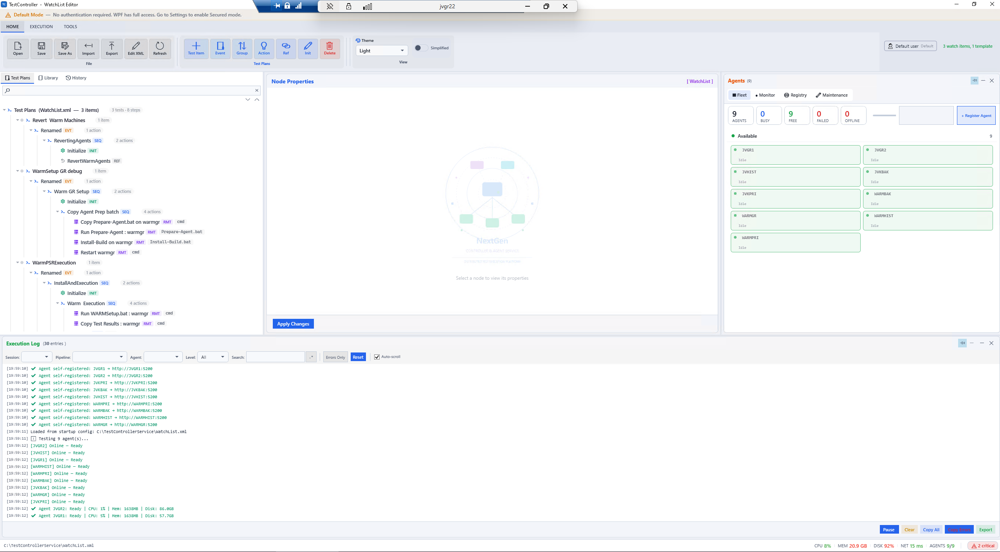

# Master Build Prompt: TestController Complete UI (WPF + React)

| Field | Value |
|---|---|
| **Scope** | Entire UI — all views + dialogs, WPF desktop AND React WebClient |
| **State** | Greenfield UI — building it right the first time (no existing UI to break) |
| **Foundation** | ONE shared design-token system → three themes (Light/Dark/High-Contrast), consistent typography, optimized layout |
| **Mockup** | `TestController_UIKit_AllViews_Mockup.html` (open it, switch themes — it IS the visual spec) |
| **Regression posture** | Because the UI is new, "no regression" means: build behind a token layer so nothing is ad-hoc, and gate each view behind tests before it's "done" |

---

## Read this first — how to use this prompt

This is a big build. Do NOT attempt it in one pass. It is organized as a
**foundation + per-view** build where the foundation is shared and each view is an
independent, testable increment. Work the phases in order. After each phase,
confirm it builds, looks like the mockup, and its tests pass — THEN move on.

The accompanying mockup (`TestController_UIKit_AllViews_Mockup.html`) is the
visual source of truth. Open it, use the theme switcher, and match what you build
to it. Every measurement, color relationship, and layout is in there.

Two hard rules that make this safe and consistent:
1. **Everything comes from tokens.** No hardcoded color, font size, or spacing on
   any control, in either WPF or React. If you're typing a hex value or a pixel
   font-size on a component, stop — it belongs in the token layer.
2. **Build the foundation before any view.** The tokens, themes, and shared
   components come first. Every view is then assembled from them.

---

## The regression story (important — read even though the UI is new)

You said "no scope for regression, it's a huge change." Here's why this approach
is safe despite the size:

- **The UI is greenfield**, so there's no working screen to break. The risk isn't
  regression in the UI — it's regression in the **logic/view-models the UI binds
  to**. So: the UI layer binds to existing view-models and services; it must NOT
  change their behaviour. Layout and styling only.
- **Token isolation = blast radius control.** Because every visual comes from the
  token layer, a change is contained. Fixing a color touches one file, not fifty
  screens. This is the structural guarantee against "change one thing, break
  another".
- **Per-view gating.** Each view is built + tested + verified against the mockup
  before the next. A problem is caught in that view, not spread across the app.
- **The full existing test suite (~1,745 tests) must stay green** throughout, because
  the UI must not alter the logic it binds to. Run it after each phase.

---

## PHASE 0 — The Design Token Foundation (build FIRST, shared by everything)

Create the token layer. This is the single source every view, both platforms, and
all three themes inherit from.

### 0.1 Token categories (define once)

| Category | Tokens |
|---|---|
| **Typography** | Families (sans = Segoe UI / system; mono = Cascadia Code / Consolas). Six sizes: title 20, header 15, body 13, label 11, caption 10, mono 12. Three weights: 400/500/600. Line-heights: title 1.3, body 1.5. |
| **Surfaces** | canvas, surface, surface-alt, field (the layering that creates depth) |
| **Borders** | border, border-strong, divider |
| **Ink** | ink (near-black/white), ink-body, ink-soft, ink-faint (the hierarchy) |
| **Accent + semantic** | accent, accent-soft, accent-ink, success, warning, danger (+ their soft fills) |
| **Elevation** | card shadow (soft), dialog shadow (stronger) |
| **Radius / spacing** | radius sm/md/lg/xl; spacing scale 4/8/12/16/20 |

### 0.2 Three theme value-sets for those tokens
Use the exact values from the mockup. The KEYS are identical across themes; only
the VALUES differ, so switching a theme swaps everything with zero per-control
change.

- **Light** — layered: grey canvas `#eef1f6`, white cards, faint-grey fields,
  near-black ink, soft shadows. (This is the enterprise look — depth, not flat white.)
- **Dark** — deep navy canvas `#0e1420`, lighter cards, brighter accent.
- **High Contrast** — pure black/white, yellow accent, hard borders on everything,
  no shadows. MUST map to Windows `SystemColors` (WPF) / `prefers-contrast` (web)
  so the OS accessibility setting drives it.

### 0.3 Platform implementation of the tokens

**WPF:**
- `Themes/Tokens.Typography.xaml` — families, sizes (as `sys:Double`), weights, and
  a named `Style` per type role (`TextTitle`, `TextHeader`, `TextBody`,
  `TextLabel`, `TextCaption`, `TextMono`).
- `Themes/Colors.Light.xaml`, `Colors.Dark.xaml`, `Colors.HighContrast.xaml` — the
  three value-sets, same keys, as `Color` + `SolidColorBrush` (referenced via
  `DynamicResource` so themes swap live).
- `Themes/Components.xaml` — shared control styles (`CardBorder`, `DialogBorder`,
  buttons, fields, chips, list rows, table) built ONLY from the tokens.
- A theme service that merges the active color dictionary at runtime and detects
  Windows High Contrast.

**React:**
- `tokens.css` (or a Tailwind config) — the SAME token names as CSS custom
  properties under `:root`, with `[data-theme="dark"]` / `[data-theme="hc"]`
  overrides (exactly as the mockup does it).
- Component styles reference `var(--token)`, never literals.
- A theme provider (Zustand slice) that sets `data-theme` and respects
  `prefers-color-scheme` / `prefers-contrast`.

> The mockup's `<style>` block is literally the React token layer — the CSS
> custom properties and the three `[data-theme]` sets can be lifted almost
> directly. Use it as the starting point.

### 0.4 Shared component library (built from tokens, used by all views)
Build these once, both platforms, matching the mockup's "Components" card:
- Buttons (primary, ghost), input field, card/panel (with shadow), dialog shell
  (stronger shadow), chip/badge (ok/warn/err/accent), pill, table, list row,
  tree node, KPI stat, progress bar, log line, nav item, toolbar button.

**Do not proceed to any view until 0.1–0.4 exist and a token smoke-test page
(the design-system section of the mockup) renders correctly in all three themes.**

---

## PHASE 1 — The App Shell (shared chrome)

The frame every view lives in, matching the mockup:
- Compact title row (brand + primary nav + user pill) — one thin row.
- Compact toolbar (icon+label inline, grouped with separators) — NOT a tall ribbon.
- Content region (where views mount).
- Collapsible execution-log strip + status bar at the bottom.
- Draggable splitters + collapsible panes (WPF: `GridSplitter` + bound sizes;
  React: a resizable-panel approach). Sizes persist per user.

Responsive/adaptive (both platforms):
- Width breakpoints: >=1600 all panes; 1366-1599 agents rail auto-collapses;
  1024-1365 agents stack; <1024 panes become tabs.
- WPF: PerMonitorV2 DPI-aware (manifest). React: fluid + breakpoints.

---

## PHASE 2 — Build each view (independent, gated increments)

Build in this order. Each is done only when it matches the mockup in all three
themes AND its tests pass. Each view binds to its EXISTING view-model / store —
**no logic change.**

| # | View | Key elements (see mockup) |
|---|---|---|
| 2.1 | **WatchList Editor** | 3-pane: tree (SEQ/PAR/EVT/REF/INIT kind tags) · node properties · agents strip. Compact toolbar. Collapsible log. |
| 2.2 | **Execution (live)** | Sessions panel (root + per-agent, running highlighted) · agent-filtered live log. |
| 2.3 | **Agents (Fleet)** | KPI strip + fleet grid, cards color-coded by state, live CPU/Mem/Disk. Virtualized for 50+. |
| 2.4 | **Monitor** | Live controller metrics (CPU/Mem/Disk bars). |
| 2.5 | **Logs (Unified)** | Filterable log stream (level, agent, search), mono lines, level colors. |
| 2.6 | **Results** | Results browser table (per-agent pass/fail/duration). |
| 2.7 | **Report Card** | Letter-grade circle + KPIs + pass/fail/skip chips. |
| 2.8 | **Admin / RBAC** | Users & roles table, role chips, add-user, per-pipeline grants. |
| 2.9 | **Dialogs** | Register Agent, Pipeline Locked, Email Compose, Login, confirmations — all use `DialogBorder` + tokens, floating shadow. |

Each view: assemble from Phase-0 components, bind to its real VM/store, verify
against the mockup in Light/Dark/HC, confirm keyboard-navigable + AutomationeProperties/aria labels.

---

## PHASE 3 — Enterprise standards pass (across all views)

- **Accessibility:** every action keyboard-reachable; logical tab order; access
  keys; `AutomationProperties.Name` (WPF) / `aria-label` (React) on interactive
  controls and regions; visible focus; WCAG AA contrast (verify in all themes).
- **High-contrast:** confirm the HC theme via OS setting; hard borders intact.
- **Virtualization:** tree + agent/fleet lists virtualized (smooth at 50+).
- **Persistence:** pane sizes/log state per user; keyed to display config for
  multi-monitor.

---

## PHASE 4 — Verification (the regression gate)

Run these before calling the UI done:
- **Visual:** every view matches the mockup in all three themes.
- **Theme swap:** switching theme changes ALL views/dialogs with no per-control
  gaps and no hardcoded colors leaking through.
- **Token audit:** grep both codebases for literal hex colors / pixel font-sizes on
  components — should be ~zero (only the token layer defines them).
- **Accessibility scan:** Accessibility Insights (WPF) / axe (React) — zero
  critical failures.
- **Resolution + DPI sweep:** 1080p, 768p laptop, 4K, split-screen; 100/150/175%
  scaling; drag across mixed-DPI monitors.
- **Logic untouched:** the full existing test suite (~1,745) still passes — proving
  the UI layer changed no behaviour.

---

## Acceptance criteria (the whole build)

| ID | Criterion |
|---|---|
| G-1 | One token layer per platform; three themes as value-sets with identical keys |
| G-2 | WPF and React use the SAME token names and the SAME six type roles |
| G-3 | Zero hardcoded colors / font-sizes on components (token audit passes) |
| G-4 | All 8 views + all dialogs match the mockup in Light, Dark, and High Contrast |
| G-5 | Switching theme updates every view + dialog with no gaps |
| G-6 | Light theme uses surface layering + shadows (enterprise depth, not flat white) |
| G-7 | Compact chrome (thin title + toolbar); collapsible log; draggable/collapsible panes |
| G-8 | Adapts across breakpoints; PerMonitorV2 DPI-aware (WPF); fluid (React) |
| G-9 | Full accessibility: keyboard, names/aria, focus, AA contrast, high-contrast |
| G-10 | Tree + fleet lists virtualized; smooth at 50+ agents |
| G-11 | Pane/log state persists per user (per display config) |
| G-12 | No logic change; all existing tests pass |

---

## Build order (do not deviate)

1. **Phase 0** — tokens + three themes + shared components. Prove with the
   design-system smoke test in all three themes. *Nothing else until this is solid.*
2. **Phase 1** — app shell (chrome, splitters, responsive, DPI).
3. **Phase 2** — views one at a time (2.1 → 2.9), each gated: matches mockup +
   tests green + accessible, before the next.
4. **Phase 3** — enterprise standards sweep across all views.
5. **Phase 4** — full verification gate.

Start with **Phase 0.1–0.2**: define the token categories and the three theme
value-sets (lift them from the mockup's `<style>` block), for BOTH platforms.
Show me the token files before building any component, so the foundation is
right before everything inherits from it.

---

## Why this is the right path (plain language)

- **Foundation first** means every screen is consistent by construction — you
  can't get drift when everything inherits from one place.
- **One token system for WPF + React** means the desktop app and the web client
  look like the same product, and a design change updates both.
- **Per-view gating** turns a huge scary change into a series of small safe ones —
  each view is proven before the next starts.
- **Token isolation** is your regression protection: the blast radius of any
  visual change is one token file, never the whole app.
- **Greenfield timing** is the gift — you're building it right once, not
  retrofitting. Do the foundation properly and the rest falls into place.
