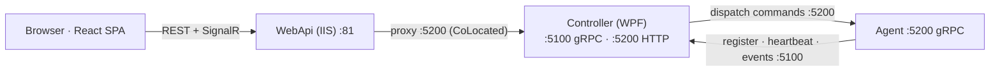
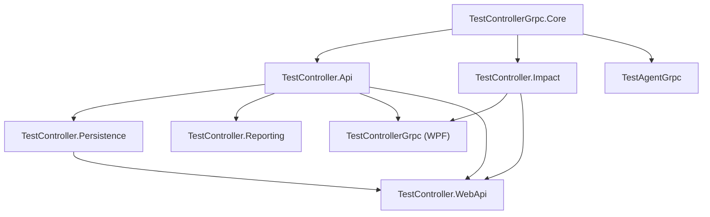

# TestAgentSolution — Complete Design

> **This is the one document.** High-level and low-level design in a single place: what the system is, how
> it is deployed, how every subsystem works internally, and how to operate it.
>
> Verified against code on 2026-09-24. Every claim cites the implementing file. Where a statement is an
> inference rather than something the code states, it says so.
>
> Companions, for depth this document deliberately summarises: [`../impact/Algorithm-As-Built.md`](../impact/Algorithm-As-Built.md)
> (impact algorithm), [`../rbac/01_System_Design.md`](../rbac/01_System_Design.md) (RBAC spec),
> [`CURRENT_STATE.md`](CURRENT_STATE.md) (type inventory), [`CONVENTIONS.md`](CONVENTIONS.md) (coding rules),
> [`README.md`](README.md) (the short map).

---

# Part I — High-Level Design

## 1. What the system is

A distributed test-orchestration platform for AVEVA System Platform QA. It watches build drop folders,
runs pipelines of actions defined in XML, dispatches those actions to remote Windows machines, streams the
output back live, and reports results. Around that core sit fleet maintenance, Azure DevOps code-churn
analysis, regression impact selection, and role-based access control.

## 2. Processes

| Process | Project | Type | Listens on | Responsibility |
|---|---|---|---|---|
| **Controller** | `TestControllerGrpc` | WPF desktop | **5100** gRPC, **5200** HTTP | Orchestration, pipeline execution, agent dispatch, owns the database |
| **WebApi** | `TestController.WebApi` | ASP.NET Core / IIS | **81** | Serves the React SPA; proxies to controller or runs standalone |
| **Agent** | `TestAgentGrpc` | Scheduled task + tray | **5200** *(agent machine)* | Executes commands, streams output, reports posture |
| **WebClient** | `TestController.WebClient` | React + Vite SPA | — | Browser UI |
| **Dashboard** | `TestController.Dashboard` | WPF | — | Read-only monitoring over SignalR |
| **AgentDisplay** | `TestAgentDisplay` | WPF | — | Single-agent gRPC monitor |
| **Diagnostics** | `TestAgent.Diagnostics` | WPF | — | Agent troubleshooting |

The controller is a **desktop app with no scheduled task** — it must be started by hand after a deploy.

## 3. Ports and call direction

`5200` appears twice, on different machines: the controller's HTTP API and every agent's gRPC listener.

| Arrow | Port | Initiator | Carries |
|---|---|---|---|
| Controller → Agent | 5200 *(agent box)* | Controller | `RunCommand`, `RunCommandStreamed`, `GetState`, `GetAgentSnapshot`, `TerminateExecution` |
| Agent → Controller | 5100 *(controller box)* | Agent | `Register`, `UnRegister`, `UpdateClientState`, `PushExecutionEvents`, `Heartbeat` |
| Browser → WebApi | 81 | Browser | REST + SignalR |
| WebApi → Controller | 5200 | WebApi | Proxied calls, CoLocated only |

The controller's gRPC port comes from `config.GetValue<int>("ControllerGrpcPort", 5100)` in
`TestControllerGrpc/Services/ControllerGrpcServerHost.cs`.

Agents are configured explicitly — `Agents: [{ Name, Address }]`. There is **no enable/disable flag**;
absence from that array is the only "off".

## 4. Deployment topologies

Selected by `ControllerProxyUrl`:

| Topology | WebApi role | DB owner |
|---|---|---|
| **WPF-only** | not deployed | Controller |
| **CoLocated** | proxies execution, auth, locks to controller `:5200` | Controller; WebApi has a null session store |
| **Standalone** | owns the whole pipeline | WebApi |

Production (JVGR22) is **CoLocated**. `/api/impact/*` is served **locally by the WebApi and is not
proxied** — impact and CodeChurn changes must ship to the web tier even in CoLocated mode.

## 5. Project dependencies

`Core` and `Api` are **shared by both hosts** — a change to either ships to the controller *and* the web
tier. This is the most common source of deployment surprises.

---

# Part II — Low-Level Design

## 6. Pipeline definition model

`TestControllerGrpc.Core/Models/WatchListConfig.cs`, parsed by
`TestControllerGrpc.Core/Services/WatchListXmlParser.cs`.

| Type | Role |
|---|---|
| `WatchListConfig` | Root: `WatchItemConfig` list + reusable `TemplateConfig` list |
| `WatchItemConfig` | One watched folder: `Tag`, `Path`, `Filter`, `Events`, `BuildNumberField`, `BuildBasePath` |
| `EventConfig` | Trigger (Created/Changed/Renamed) + `ExecutionType` + child nodes |
| `IActionNode` | Base for the tree |
| `ActionGroupConfig` | SEQ/PAR container, `FailAndContinue` flag |
| `ActionConfig` | Executable leaf |
| `InitializeConfig` | Loads a parameter file into context |
| `RefConfig` | Expands a `TemplateConfig` by ID |

`ActionConfig` carries `Type` (RunCommand / RunRemoteCommand / SendMail), `AgentName`, `Command`,
`Parameters`, `Timeout` (seconds, 0 = infinite), `PollInterval` (1000 ms), `MaxRetries`, `RetryBackoff`,
`RetryOnExitCodes`, `IsReboot`, `Tag`.

Parsing is an `XElement` walk switching on element name, with attribute defaults
(`Filter="*.*"`, `PollInterval=1000`, `ExecutionType="Sequential"`).

## 7. Execution pipeline

`TestControllerGrpc/Services/ActionPipelineExecutor.cs`.

**Tree walk.** `ExecuteEventAsync` → `ExecuteGroupAsync` per node:

- **Sequential** — await each child; stop at first failure unless `FailAndContinue=true`
- **Parallel** — `Task.WhenAll` over all children; **no early termination**, every branch runs to completion

**Single action** (`ExecuteSingleActionAsync`):

1. Resolve parameters — `ParameterResolver.ResolveAction()` substitutes tokens from `ctx.Parameters`
2. Retry loop — `maxAttempts = 1 + max(0, MaxRetries)`
3. Exponential backoff — `delaySeconds * 2^(attempt-2)`, **capped at 300 s**
4. Dispatch by type — remote → `ExecuteRemoteCommandAsync`, local → `ExecuteLocalCommandAsync`, mail → SMTP
5. Record — `sessionManager.RecordResult(...)`
6. Retry decision — `ShouldRetry(result, retryExitCodes)`

Events raised during the walk: `LogEntry`, `NodeProgress` (Running/Success/Failed/Cancelled), `NodeFailed`.

**Cancellation** is cooperative — `ctx.CancellationToken` is honoured at every await; the token lives on
the `ExecutionSession`.

**Retry-failed** (`RetryFailedAsync`) re-runs only actions whose `Outcome != Success`, reusing the
originally resolved parameters.

## 8. Agent dispatch

`IAgentGrpcDispatcher` has two implementations: `ControllerGrpcServerDispatcher` (WPF host) and
`StandaloneAgentDispatcher` (WebApi host).

Flow: resolve parameters → look up the agent in the registry → build `RunCommandRequest` → call the
streaming RPC → accumulate `CommandEvent`s → return `ActionResult(success, exitCode, lastLine)`. An
unregistered agent yields `ActionResult(false, -1, "Agent not registered")`.

> **Design limitation.** `ActionResult` carries **no stdout**. Features needing command output must read
> the dispatcher's `OutputReceived` event instead — which is why `NodeUpdateInstaller` wraps its payload in
> a `##TCWU##` sentinel and filters by agent name.

## 9. Agent internals

`TestAgentGrpc/Services/` — `AgentLifecycleService`, `CommandExecutor`, `SystemMetricsCollector`.

**Startup:** validate controller address → register with exponential-backoff retry → subscribe to executor
state changes → start heartbeat (10 s default, carrying `AgentState` + metrics) → open the bidirectional
event-push stream → audit `AgentStarted`. On shutdown, unregister.

**Command execution:** a `SemaphoreSlim(1,1)` enforces **one command at a time**; acquisition has a 5 s
timeout, and failure returns rejected plus a `CommandRejected` audit entry. The process is started with
stdout/stderr redirected, no shell, no window; `.bat`/`.ps1` get interpreter wrapping. Output is read
line-by-line in parallel with `WaitForExitAsync`, each line broadcast as an `ExecutionEvent`.

**Three independent kill paths:** the action's own `Timeout`; the agent-level `MaxExecutionTimeoutMinutes`
cap; and a silence watchdog (`SilenceThresholdSeconds`) for commands that hang without output.

## 10. Session and execution state

`TestControllerGrpc.Core/Services/ExecutionSessionManager.cs`.

A session is one pipeline invocation: 12-character id, `WatchItemTag`, `StartedUtc`, `State`
(Running/Succeeded/Failed/Cancelled), `UserId`, `Source` ("WebClient"/"WPF"), `LockedAgents`,
`ResolvedParameters`, and `SnapshotNodes` — a **deep clone of the action tree** so node addressing stays
stable while the underlying WatchList may be reloaded.

`BeginSession` is idempotent on an existing id, which preserves pre-set `UserId`/`Source`/`LockedAgents`.
Results accumulate in a `ConcurrentBag`. Persistence to `Sessions/sessions.json` is **throttled to once per
5 seconds** during execution, with a final write on completion; history keeps the **last 50** sessions and
is restored on startup for post-crash rendering.

## 11. RBAC runtime

`TestController.Persistence/OrchestratorDbContext.cs` — SQLite, WAL, `synchronous=NORMAL`, foreign keys on,
auto-migrated at startup.

| Entity | Holds |
|---|---|
| `Users` | Account, `PasswordHash`, `Role` (Admin/Engineer/Guest), `IsActive` |
| `Sessions` | Bearer token, `ClientKind`, `CreatedUtc`, `LastUsedUtc`, `ExpiresUtc` |
| `PipelineAssignments` | Which WatchItem tags a user may run |
| `AuditEntries` | Immutable allow/deny decisions, **90-day retention** |
| `NotificationMutes` / `NotificationCooldowns` | Per-user notification suppression |
| `MaintenanceOperationRecords` | Fleet maintenance history |

**Validation** happens in `TestController.Api/Interceptors/SessionAuthInterceptor.cs` on every gRPC call:
read `Authorization: Bearer`, look up the session, reject if idle > **60 minutes** (or, for guests, if
created > 60 minutes ago), update `LastUsedUtc` fire-and-forget, then hydrate `IUserContext` with roles and
assigned pipelines.

**Permissions** — 19 named values. Admin has all; Engineer has everything except `Pipeline_ForceRelease`
and user administration; Guest is view-only. `Pipeline_Trigger` additionally requires the tag to be in
`AssignedPipelineIds`. Enforcement is `[RequirePermission(...)]` → `IAuthorizationService.CanAsync(...)` →
403 on denial.

**Audit is fire-and-forget by design** — enqueued to `IAuditWriter` and drained by a background worker.
It must never be awaited in a request path.

**Default vs Secured mode** (`RBAC.Enabled`): Default injects a synthetic user per client kind and performs
no database work; Secured enforces the full path. Switching requires a restart, because DI registration
differs.

## 12. Fleet maintenance

`TestControllerGrpc.Core/Maintenance/`.

States form a small machine — `None`, `Rebooting`, `Reverting`, `Updating`, `Quarantined`. Operations:
machine reboot (`shutdown /r … /m \\host`, **not** `TerminateExecution`), VM revert to snapshot via a
PowerShell provider, golden-image refresh (**deliberately not registered**), and Windows-update install.

`DispatchGate.GetMaintenanceBlockers` blocks dispatch on **any** state other than `None`, and all three
trigger paths consult it — so a false maintenance flag stops pipelines.

`FleetMaintenanceService.RunAsync` converts a fault while in a transient state into `Quarantined`;
quarantine is sticky with one exit, `ClearQuarantineAsync`.

`NodeUpdateInstaller` dispatches base64-encoded PowerShell and reads results off `OutputReceived` using the
sentinel envelope described in §8.

**Reboot-required detection** (`TestAgentGrpc/Services/WindowsUpdateDetector.cs`) trusts only the two
servicing-owned registry keys. `PendingFileRenameOperations` is counted and logged but does **not** flag a
node unless `TreatPendingFileRenamesAsRebootRequired` is set — it defaults false, because product installers
routinely leave file renames queued and were causing ~100 % false alarms.

Pending-update scanning uses `searcher.Online = false` — the **local cache only**. Posture is therefore
only as fresh as the node's last successful Windows Update scan, and a failed search returns `0` and logs
at Debug, making failure indistinguishable from a clean node.

## 13. Azure DevOps and CodeChurn

`TestControllerGrpc.Core/Ado/`.

`AdoRegressionDataProvider` routes on `AdoCollectionMode` (default `Components`):

- null window + branch → `ComponentChangeCollector.CollectBranchSinceCreationAsync` (git-centric branch scan)
- otherwise → `ComponentChangeCollector.CollectAsync` (timeline window)
- `IsSpAnchored` → `SpBuildImpactCollector` (legacy SP-manifest diff)

**Churn baselining.** The window start is the previous **successful** build on the **same branch**
(`ResolveBranchWindowStart`). With no such build it falls back to 30 days, floored at the branch's first
build. Commits and PRs are sorted newest-first **before** the 200-item cap, so truncation drops old history
rather than the build's own work.

`GetBuildChangesAsync` pages with `$top=200` and follows `x-ms-continuationtoken`, capped at 20 pages.
Results are de-duplicated by change id. `AdoClient.GetWithContinuationAsync<T>` exists because ADO returns
the token in a **header**, never the body.

## 14. Impact analysis

Summarised here; full detail in [`../impact/Algorithm-As-Built.md`](../impact/Algorithm-As-Built.md).

A six-stage cascade: risk score → anchors (can exit early) → query build → hybrid BM25 + dense retrieval
fused by RRF → LLM rerank → MMR + knapsack selection under a time budget → record.

**In the default configuration dense retrieval, LLM rerank, HyDE, risk weighting and the run manifest are
all off, and the learning loop never closes** — so what actually runs is `anchors → BM25 → pass-through
rerank → MMR + knapsack`.

Two databases by design: `impact-index.db` (rebuildable cache, has reached 1.29 GB, git-ignored) and
`impact-outcomes.db` (durable learning history). Only the host registered `ImpactHostRole.ReaderWriter`
rebuilds the index — that is the WebApi; the WPF host registers `Reader`.

## 15. Locking — two unrelated layers

| Layer | Type | Locks | Scope |
|---|---|---|---|
| `AgentLockManager` (Core) | file-persisted | **agent machines** | per execution session |
| `LockRegistry` (Api) | in-memory, controller-only | **WatchItems** | per user/client |

They are frequently conflated and must not be. The WebApi proxies pipeline-lock calls to the controller.

## 16. Realtime and the web client

SignalR hub `/hubs/controller` broadcasts execution events, node progress, lock state and mode changes;
clients auto-reconnect with resync. The React client is Vite + TypeScript + Tailwind + **Zustand** (one
store per domain), calling a custom `apiFetch<T>()` wrapper in `src/lib/api.ts` — not raw `fetch`.

---

# Part III — Cross-cutting

## 17. Logging

`IAppLogger` — **custom, not Serilog**. Pattern: `_logger.Info("Category", "message")`,
`.Warn(...)`, `.Error("Category", "msg", ex)`. Sinks: in-memory ring buffer (5000 entries), rolling daily
file, error-only file. `ILogger<T>` is used only for framework-level hosted-service logging. Agents keep a
separate audit log with secrets redacted via `SecurityRedactor.RedactCommandLine()`.

## 18. Configuration

| Section | Binds to | Notable keys |
|---|---|---|
| `Agents[]` | — | `Name`, `Address` — the entire agent roster |
| `ControllerGrpcPort` | — | 5100 |
| `ControllerProxyUrl` | — | Selects CoLocated vs Standalone |
| `Controller:Timeouts` | — | `TestConnectionTimeoutSeconds` 5, `PingTimeoutSeconds` 3, circuit breaker |
| `Ado` | `AdoOptions` | `Organization`, `Project`, `OmiProject`, `CollectionMode`, `SpBuilds`, `RevertScriptPath` |
| `ImpactMapping` | `ImpactMappingOptions` | Retrieval, rerank, selection, risk, learning knobs |
| `WindowsUpdate` | `WindowsUpdateSettings` | `Enabled`, `ScanPendingUpdates`, `PollIntervalSeconds` 300, `SnapshotIntervalSeconds` 3600 |
| `AgentSettings` | `AgentSettings` | `AgentName`, `ControllerAddress`, `GrpcPort`, `SilenceThresholdSeconds` |
| `RBAC` | `RbacOptions` | `Enabled` — Default vs Secured |

Deployed configs are **hand-tuned and ahead of source**. `Invoke-Patch.ps1` never overwrites them; it
reports missing keys only.

## 19. Conventions

Singleton DI by default (`OrchestratorDbContext` is the exception — Scoped, reached from singletons via
`IDbContextFactory<>`); CommunityToolkit.Mvvm `[ObservableProperty]`/`[RelayCommand]` for WPF view models;
Zustand for React state; `Method_Should_Expected_When_State` test naming; app-generated GUIDs (SQLite has
no `NEWID()`).

---

# Part IV — Operations

## 20. Deploying

| Target | Script |
|---|---|
| Controller / web | `deploy\Invoke-Patch.ps1 -Component controller\|web\|both` — dry-run by default, `-Apply` to write |
| Agents | `deploy\Invoke-FleetDeployment.ps1 -Only node1,node2` — `-DryRun` by default |

Both take timestamped backups and print a rollback command.

**Four traps, all encountered in practice:**

1. **Stop the IIS app pool yourself.** `app_offline.htm` has failed to release in-process DLL locks,
   producing a **mixed build set** (new Core beside old Api) that still returned HTTP 200 because the old
   assembly was already resident. Use `appcmd stop apppool`, patch, then `start`.
2. **The web health check runs before you restart the pool**, so a successful patch reports `503` and exits
   1. Judge it by the `patched and SHA256-verified` line, not the exit code.
3. **The fleet script checks port 5200 immediately after starting the task**, before the agent binds. It
   warned `5200 CLOSED` on 10 of 12 nodes that were all healthy moments later.
4. **`-IncludeSpa` does not build the SPA.** It ships whatever is in the git-tracked
   `TestController.WebApi\wwwroot`. Run `npm run build` and robocopy `dist` first.

## 21. Known gaps

| Gap | Effect |
|---|---|
| Impact learning loop never closes — `RecordExecutionAsync()` is not called | Failure rates stay empty; ~30 % of selection weight carries no signal |
| Agent update scan is cache-only and fails silently to `0` | A broken scan is indistinguishable from a clean node |
| `WindowsUpdateStatusDto` has no scan timestamp | Cannot tell a fresh zero from an eleven-week-old one |
| WinRM dead on several nodes | They are deployable but not diagnosable |
