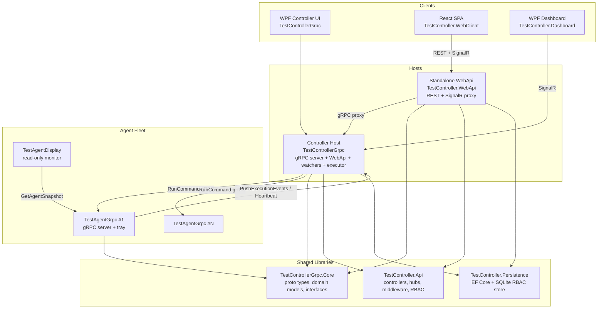
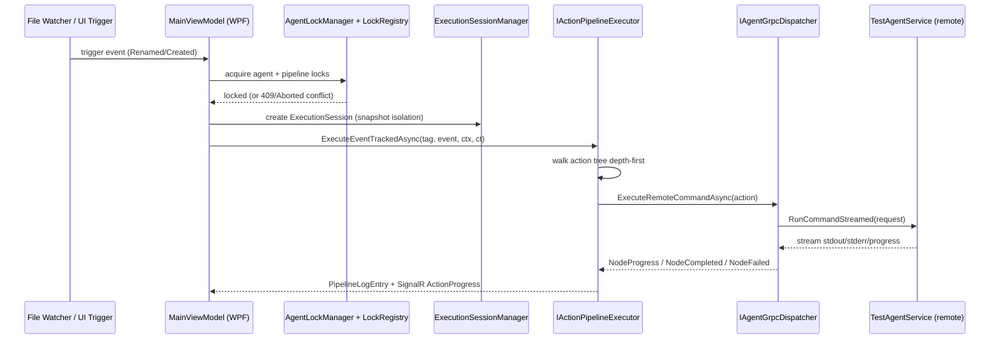

# Architecture & Codebase Guide — Feature Planning Reference

> **Purpose:** A single planning-oriented map of the current architecture, the seams where new
> features plug in, and a repeatable checklist for scoping a new feature across all tiers.
>
> **Authoritative companions (read for detail, do not duplicate here):**
> - [CURRENT_STATE.md](CURRENT_STATE.md) — exhaustive current types, DI, executor flow, WatchList schema, load-bearing weirdness.
> - [CONVENTIONS.md](CONVENTIONS.md) — coding patterns (MVVM, Zustand, `AppLogger`, DI lifetimes, test naming).
> - [WebApi-DB-Decoupling.md](WebApi-DB-Decoupling.md) — how the standalone WebApi stays DB-free and proxies the controller.
> - Root [ARCHITECTURE.md](../../ARCHITECTURE.md) and [docs/ARCHITECTURE.md](../ARCHITECTURE.md) — narrative overview.

---

## 1. System at a Glance

TestAgentSolution is a **distributed gRPC test-orchestration platform** for AVEVA System Platform
QA automation. A controller watches for build/trigger files, walks an action pipeline defined in
`WatchList.xml`, and dispatches commands to a fleet of Windows agents over gRPC. Two client
surfaces (WPF desktop + React web) observe and drive execution in real time.



### Two host topology (critical to understand before designing a feature)

| | **Controller Host** (`TestControllerGrpc`, WPF) | **Standalone WebApi** (`TestController.WebApi`) |
|---|---|---|
| Owns the executor? | **Yes** — real `ActionPipelineExecutor`, `LockRegistry`, watchers, agent connections | No — `StandalonePipelineExecutor` + `ControllerProxyService` forward to the controller |
| Talks to agents? | Directly via gRPC | Proxies through the controller |
| Talks to SQLite RBAC DB? | Yes (primary host) | Yes for auth/session, but authz **short-circuits** (`NullAuthorizationService` → `Allow("proxy-bypass")`) |
| Serves which UI? | WPF MVVM + its own embedded WebApi | React SPA |
| `isPrimaryHost` | `true` | `false` |

**Implication:** Any stateful orchestration feature (locks, execution state, agent registry) lives in
the **controller** and is *proxied* from the WebApi. The WebApi is a thin, DB-light edge. See
[WebApi-DB-Decoupling.md](WebApi-DB-Decoupling.md).

---

## 2. Project Map (where code lands)

| Project | Role | Add feature code here when… |
|---------|------|------------------------------|
| `TestControllerGrpc.Core` | Proto types, domain models, **service interfaces**, enums, XML parser, `AppLogger` | You need a new shared interface, domain model, enum, or proto contract |
| `TestController.Api` | Shared controllers, SignalR hubs, middleware, RBAC wiring (`AddControllerApi()`, `AddRbacFeature()`) | You add a REST endpoint, SignalR event, interceptor, or authz-gated service used by **both** hosts |
| `TestController.Persistence` | EF Core + SQLite (`OrchestratorDbContext`, entities, migrations, repositories, audit) | Your feature needs durable storage (new table/migration/repository) |
| `TestController.WebApi` | Standalone REST/SignalR host for React; proxies to agents | You add host-specific DI, a proxy adapter, or edge middleware for the web path |
| `TestControllerGrpc` (WPF) | All-in-one host: gRPC server + WebApi + watchers + executor + MVVM UI | You add executor logic, a WPF view/viewmodel, or controller-only orchestration |
| `TestController.WebClient` | React 18 + TS + Vite + Tailwind + Zustand + SignalR | Any web UI: store, hook, view, component, SignalR subscription |
| `TestAgentGrpc` | Windows agent service (gRPC + tray) | The feature changes agent-side command execution, policy, or telemetry |
| `TestAgentDisplay` / `TestController.Dashboard` / `TestAgent.Diagnostics` | Auxiliary read-only WPF clients | Rarely — monitoring/diagnostic surfaces only |
| `*.Tests` / `*.ApiTests` / `*.LoadTests` | xUnit + Vitest test suites | Always — tests follow the code structure |

---

## 3. Communication Contracts (the wires a feature crosses)

### gRPC (controller ⇄ agents)
Single proto: `TestControllerGrpc.Core/Protos/test_agent.proto`.
- **`TestControllerService`** (hosted by controller): `Register`, `UnRegister`, `UpdateClientState`,
  `PushExecutionEvents` (client-streaming), `Heartbeat`.
- **`TestAgentService`** (hosted by each agent): `GetState`, `RunCommand`, `RunCommandStreamed`
  (server-streaming), `SubscribeAgentEvents`, `TerminateExecution`, `ForceReady`,
  `GetExecutionHistory`, `GetAgentSnapshot`, `GetAuditLog`, `GetConnectionHealth`, `ReloadCommandPolicy`.
- Auth flows through `SessionAuthInterceptor` (session token → `IUserContext`).

> **Proto duplication is load-bearing:** `TestAgentGrpc` generates its own proto types *and*
> references Core's copy; `<NoWarn>CS0436</NoWarn>` suppresses the clash. Do not remove either.

### REST + SignalR (web/desktop ⇄ hosts)
- REST controllers live in `TestController.Api/Controllers/`; the React client calls them through the
  custom `apiFetch<T>()` wrapper (`src/lib/api.ts`) — never raw `fetch`/axios.
- Real-time hub: `/hubs/controller`. Existing events include `ActionProgress`,
  `ExecutionStarted/Completed/Cancelled`, `AgentRegistered/StatusChanged`, `LogEntry`,
  `AgentOutputBatch`, `SystemModeChanged`, and the pipeline-lock events
  (`PipelineLockAcquired/Released/Expired/Stolen/Rewritten`).
- **Live-state pattern (reuse this):** broadcast deltas + **full resync on reconnect** via a
  `GET` endpoint (e.g. `GET /api/locks`). Never poll. Server responses carry the full DTO the error
  UI needs (no refetch).

### Configuration files
- Agent command allowlist: `TestAgentGrpc/commandpolicy.json` (hot-reloadable via `ReloadCommandPolicy`).
- Orchestration definition: `WatchList.xml` (schema in [CURRENT_STATE.md](CURRENT_STATE.md#watchlistxml-schema)).
- RBAC toggle: `RBAC:Enabled` in `appsettings.json` (Default vs Secured mode).

---

## 4. The Execution Pipeline (the core domain flow)



**Extension seams in this flow:**
- New action type → extend the executor's action dispatch + `WatchList.xml` schema + parser in Core.
- New gating rule → `PipelineAuthorizationGuard` (authz Allow → lock acquire → audit).
- New telemetry → emit a SignalR event + add a Zustand store + hook on the web side.

> Two independent lock layers coexist and must **not** be merged:
> `AgentLockManager` locks *agent machines* per execution session; `LockRegistry` locks
> *WatchItems (Tag)* per user/client. See [CURRENT_STATE.md](CURRENT_STATE.md) §Pipeline Lock.

---

## 5. Cross-Cutting Systems a Feature Must Respect

### RBAC & System Mode (Default vs Secured)
- **Default mode** (RBAC off): fail-open. WPF → allow all; Web → allow reads only.
  `SessionAuthInterceptor.ResolveUserAsync` returns `DefaultUser.ForClient(clientKind)`.
- **Secured mode** (RBAC on): real session tokens, `IAuthorizationService.CanAsync(user, permission, resourceId?)`.
- **Gate pattern for new mutating endpoints:** resolve RBAC services lazily; return *allow* when
  `RbacOptions.Enabled == false` (zero behaviour change while off), enforce `CanAsync` only in Secured
  mode. Follow `ExecutionController.IsRbacAuthorizedAsync` / `PipelineAuthorizationGuard`.
- Permissions enum: `TestControllerGrpc.Core/Authorization/Permission.cs`. Role→permission catalog:
  `TestController.Api/PermissionCatalog.cs`.
- **Audit is fire-and-forget:** enqueue via `IAuditWriter`; never `await` it in the request path.
- Two `IAuthorizationService` types exist (`Microsoft.AspNetCore.Authorization` vs
  `TestControllerGrpc.Authorization`) — fully-qualify when both usings are present.

### Logging
- Custom `IAppLogger` (**not** Serilog): `_logger.Info("Category", "message")` / `.Warn(...)` /
  `.Error("Category", "msg", ex)`. All output passes through `SecurityRedactor.Redact()`.
- Use `ILogger<T>` only for framework-level logging in hosted services.

### DI lifetimes
- **Singleton by default** (the codebase is Singleton-heavy). Only `OrchestratorDbContext` is Scoped
  (EF Core); Singleton services reach it via `IDbContextFactory<OrchestratorDbContext>`.
- All UUIDs are app-generated (`Guid.NewGuid()`, stored lowercase-hyphenated TEXT) — SQLite has no `NEWID()`.

### UI state conventions
- **WPF:** CommunityToolkit.Mvvm only — `[ObservableProperty]` / `[RelayCommand]`. No manual `INotifyPropertyChanged`.
- **React:** Zustand, one store per domain (`useXxxStore`). No Redux, no Context for global state.

---

## 6. New-Feature Planning Checklist

Work through these tiers for any feature; skip a row only when clearly N/A.

### 6.1 Contracts & domain (Core)
- [ ] New domain model / enum / interface in `TestControllerGrpc.Core`?
- [ ] New or changed gRPC RPC/message in `test_agent.proto`? (remember proto duplication)
- [ ] New `Permission` entry + role mapping in `PermissionCatalog.cs`?

### 6.2 Persistence (only if durable state)
- [ ] New entity + `IEntityTypeConfiguration<T>` in `TestController.Persistence`?
- [ ] EF Core migration added (`TestController.Persistence/Migrations/`)?
- [ ] Repository/service exposing it, injected via `IDbContextFactory`?

### 6.3 Orchestration / server logic (Api + Controller)
- [ ] New REST endpoint in `TestController.Api/Controllers/`?
- [ ] Registered in `AddControllerApi()` / `AddRbacFeature()` for **both** hosts?
- [ ] RBAC-gated with the Default-mode fail-open pattern?
- [ ] Audit entry enqueued (fire-and-forget)?
- [ ] Controller-only state (locks/executor)? If so, add a `ControllerProxyService` forward for the WebApi.

### 6.4 Real-time (SignalR)
- [ ] New hub event on `/hubs/controller`?
- [ ] Full-resync `GET` endpoint for reconnect (no polling)?
- [ ] Response DTO carries everything the error/success UI needs?

### 6.5 Agent tier (only if agent behaviour changes)
- [ ] New/changed `TestAgentService` RPC or command-policy rule?
- [ ] `commandpolicy.json` allowlist update + hot-reload path?

### 6.6 WPF UI
- [ ] View + ViewModel (CommunityToolkit.Mvvm) added to `TestControllerGrpc/Views` + `ViewModels`?
- [ ] `[RelayCommand(CanExecute = …)]` gated by capability + lock state?
- [ ] Visual-tree integration diff shipped **with** the control (convention)?

### 6.7 Web UI
- [ ] Zustand store (`src/stores/`) + domain hook?
- [ ] View/component + SignalR subscription wired in `AppShell.tsx` / `useSignalR.ts`?
- [ ] All calls go through `apiFetch<T>()`; 401/403 → `AuthDeniedToast`, 409 → conflict modal?

### 6.8 Tests
- [ ] Unit tests (`Method_Should_Expected_When_State`) beside the code?
- [ ] WebApi integration tests in `TestController.WebApi.Tests` (the WPF-host test project fails on file locks — prefer this one)?
- [ ] Vitest tests for new web stores/components?

### 6.9 Config & docs
- [ ] New `appsettings.json` keys documented + validated in `ConfigValidator`?
- [ ] `CURRENT_STATE.md` updated with the new surface once the feature lands?

---

## 7. Known Environmental Gotchas (won't block design, will block builds/tests)

- **WPF host + its test project fail to build with file-lock errors** (MSB3021/MSB3027) when the
  controller process or VS holds the output DLLs. These are environmental, **not** compile errors.
  Use the language server / `get_errors` as the authoritative compile check, and run integration
  tests via `TestController.WebApi.Tests`.
- **Build output ACLs:** `obj`/`bin` folders may be owned by `BUILTIN\Administrators` (created by an
  elevated/deploy build), causing `Access denied` on restore/build. Fix ownership once (elevated), or
  build into a user-owned artifacts path (`/p:UseArtifactsOutput=true /p:ArtifactsPath=…`).
- **`App.Services` static locator** in the WPF host is load-bearing for window construction.
- **ThreadPool pre-warm** (`SetMinThreads(200,200)`) in the WebApi is required for 200-agent load.

---

## 8. Quick Commands

```powershell
# Build (redirect output if obj/bin ACLs are locked)
dotnet build TestAgentSolution.sln /p:UseArtifactsOutput=true /p:ArtifactsPath=C:\Temp\tas-artifacts

# Tests with coverage
dotnet test TestAgentSolution.sln --collect:"XPlat Code Coverage" --settings coverlet.runsettings

# React client
cd TestController.WebClient
npm run dev     # vite dev server
npm run build   # tsc -b && vite build
npm run test    # vitest run

# Full publish pipeline (.NET + React + tests + deploy)
.\Publish-All.ps1
```
