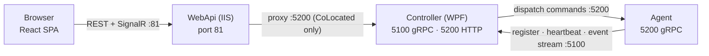
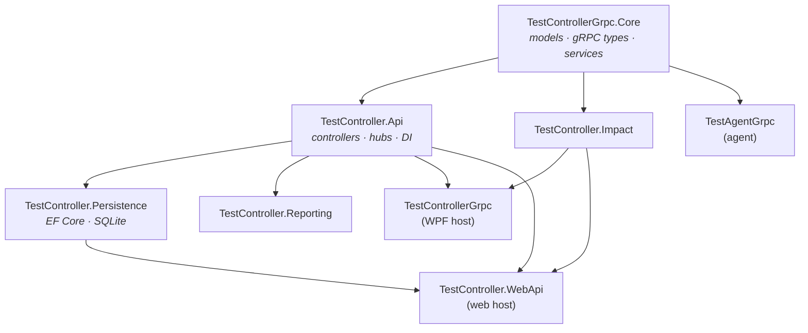

# Architecture — Start Here

> **What this is.** A single verified map of the running system: processes, ports, call direction,
> dependencies and data stores. It is an **entry point**, not a replacement — the deeper documents are
> listed below and this file links into them rather than restating them.
>
> Verified against code on 2026-09-24. Where the older documents disagree with the code, §9 records it.

| If you want… | Read |
|---|---|
| **The complete story — HLD + LLD, everything** | [**`COMPLETE_DESIGN.md`**](COMPLETE_DESIGN.md) |
| The map — hosts, ports, who calls whom | this file |
| C4-style container and component diagrams | [`../ARCHITECTURE-DIAGRAMS.md`](../ARCHITECTURE-DIAGRAMS.md) |
| Narrative design and rationale | [`SYSTEM_DESIGN.md`](SYSTEM_DESIGN.md) |
| Types, DI registrations, current code facts | [`CURRENT_STATE.md`](CURRENT_STATE.md) |
| Coding patterns and conventions | [`CONVENTIONS.md`](CONVENTIONS.md) |
| Full component catalogue and gRPC contracts | [`../../ARCHITECTURE.md`](../../ARCHITECTURE.md) |
| Impact-analysis algorithm as built | [`../impact/Algorithm-As-Built.md`](../impact/Algorithm-As-Built.md) |
| RBAC design and phases | [`../rbac/01_System_Design.md`](../rbac/01_System_Design.md) |

---

## 1. Processes

| Process | Project | Type | Listens on | Responsibility |
|---|---|---|---|---|
| **Controller** | `TestControllerGrpc` | WPF desktop app | **5100** gRPC, **5200** REST+SignalR | Orchestration, WatchList pipelines, agent dispatch, owns the database |
| **WebApi** | `TestController.WebApi` | ASP.NET Core in IIS | **81** (IIS site) | Serves the React SPA; proxies to the controller, or runs autonomously |
| **Agent** | `TestAgentGrpc` | Scheduled task + tray | **5200** gRPC *(on the agent machine)* | Executes commands locally, streams output, reports posture |
| **WebClient** | `TestController.WebClient` | React SPA (Vite) | — | Browser UI, served from WebApi `wwwroot` |
| **Dashboard** | `TestController.Dashboard` | WPF | — | Read-only monitoring over SignalR |
| **AgentDisplay** | `TestAgentDisplay` | WPF | — | gRPC client to one agent |
| **Diagnostics** | `TestAgent.Diagnostics` | WPF | — | Agent troubleshooting utility |

The controller is a **desktop application with no scheduled task** — after a deploy it must be started by
hand on the target.

---

## 2. Ports and call direction

This is the part most often got wrong, because **5200 appears twice on different machines**: the controller's
HTTP API and the agent's gRPC listener both use it, on different hosts.

**Both directions exist between controller and agent, on different ports:**

| Arrow | Port | Initiator | Carries |
|---|---|---|---|
| Controller → Agent | 5200 *(agent machine)* | Controller | `RunCommand`, `GetState`, `GetAgentSnapshot`, `TerminateExecution` |
| Agent → Controller | 5100 *(controller machine)* | Agent | `Register`, `UnRegister`, `UpdateClientState`, `PushExecutionEvents`, `Heartbeat` |
| Browser → WebApi | 81 | Browser | REST + SignalR |
| WebApi → Controller | 5200 | WebApi | Proxied calls, CoLocated topology only |

Agent addresses are configured explicitly, not discovered — `Agents: [{ Name, Address }]` in the host
`appsettings.json`. An agent that is absent from that array does not exist as far as that host is
concerned; there is **no enable/disable flag**.

---

## 3. Deployment topologies

Determined by `ControllerProxyUrl`. Three shapes, not two:

| Topology | WebApi role | Database |
|---|---|---|
| **WPF-only** | not deployed | Controller owns it |
| **CoLocated** | proxies execution, auth and locks to the controller at `:5200` | Controller owns it; WebApi holds a null session store |
| **Standalone** | owns the whole pipeline itself | WebApi owns it |

Production on JVGR22 is **CoLocated**: IIS site `TestControllerWeb` on port 81, proxying to
`http://localhost:5200`.

Note `/api/impact/*` is served **locally by the WebApi** and is *not* proxied — which is why impact and
CodeChurn changes must be deployed to the web tier even in CoLocated mode.

---

## 4. Project dependencies

`TestControllerGrpc.Core` and `TestController.Api` are **shared by both hosts**. A change to either ships
to the controller *and* the web tier — the single most common source of deployment surprises.

---

## 5. Data stores

| Store | File | Written by | Durable | Holds |
|---|---|---|---|---|
| Orchestrator DB | `orchestrator.db` | **Controller only** | yes | Users, roles, sessions, assignments, audit |
| Pipeline definitions | `WatchList.xml` | file watcher | yes | Action tree, templates, retry policy |
| Parameters | `Parameters\` | file watcher, imports | yes | Build parameters, environment config |
| Impact index | `impact-index.db` | **WebApi only** (`ReaderWriter`) | regenerable | BM25 postings, vectors, corpus stats |
| Impact outcomes | `impact-outcomes.db` | every host | yes | Run outcomes feeding the ranker |
| Agent locks | `agent-locks.json` | Controller | transient | Per-session agent machine locks |
| Logs | `Logs\*.log` | each process | yes | Rolling daily logs |

**Single-writer rules are load-bearing.** The controller is the sole writer of `orchestrator.db`; the WebApi
registers RBAC with `isPrimaryHost: false` and holds a null session store. Only the host registered as
`ImpactHostRole.ReaderWriter` rebuilds the impact index — the WPF host registers as `Reader` and never
writes it.

`impact-index.db` is a **regenerable cache** that has reached 1.29 GB. It is git-ignored and must never be
placed inside the repo.

---

## 6. Cross-cutting services

| Concern | Where | Notes |
|---|---|---|
| Logging | `IAppLogger` (Core) | Custom, **not Serilog**. `_logger.Info("Category", "message")` |
| Authentication | `AddMultiIdentitySecurity()` (Api) | NTLM/negotiate + API key + roles |
| Authorisation | `AddRbacFeature()` (Persistence + Api) | Session-based; `SessionAuthInterceptor` on gRPC |
| Audit | `IAuditWriter` (Persistence) | **Fire-and-forget queue** — never awaited in a request path |
| Realtime | SignalR `/hubs/controller` | Execution events, lock state, mode changes |
| Agent auth | `AgentAuthInterceptor` | Shared secret via `x-agent-token` |

**Two distinct lock layers** — a frequent confusion:

- `AgentLockManager` (Core) locks **agent machines** per execution session
- `LockRegistry` (Api) locks **WatchItems** per user or client

They are unrelated and must not be conflated.

---

## 7. Request flows

**React page load.** Browser → WebApi `:81` → SPA bundle → SignalR connects to `/hubs/controller` →
CoLocated: WebApi proxies data calls to controller `:5200`; Standalone: WebApi serves them itself.

**Pipeline trigger.** WebClient `POST /api/execution/trigger` → authorisation and lock check → proxied to
controller (CoLocated) → `ActionPipelineExecutor` walks the WatchList tree → `AgentGrpcDispatcher` dials the
agent at `:5200` → agent spawns the process and streams stdout/stderr → agent pushes `ExecutionEvent`s back
to controller `:5100` → controller broadcasts over SignalR → React store updates.

**Agent posture.** Agent starts → dials controller `:5100` → `Register` → periodic `Heartbeat` with system
metrics → `WindowsUpdateDetector` polls registry and the local WU cache → reports reboot-required and
pending-update counts → controller broadcasts → Fleet view renders.

---

## 8. Deploying

| Target | Script | Notes |
|---|---|---|
| Controller and/or web | `deploy\Invoke-Patch.ps1` | Dry-run by default; `-Component controller\|web\|both`; `-Apply` to write |
| Agents | `deploy\Invoke-FleetDeployment.ps1` | `-Only node1,node2`; `-DryRun` by default |

Two traps worth knowing before you run either:

- **The web tier's health check runs before you restart the app pool.** If you stop the pool yourself (which
  you should — `app_offline.htm` has failed to release in-process DLL locks, leaving a mixed build set that
  still returns 200), the script reports `503` and exits 1 on a *successful* patch. Judge it by the
  `patched and SHA256-verified` line, not the exit code.
- **The fleet script verifies port 5200 immediately after starting the task,** before the agent has bound.
  A `5200 CLOSED` warning usually means "check again shortly", not "failed".

---

## 9. Corrections to the older documents

Found while verifying this map. Recorded rather than silently fixed, since the documents are owned elsewhere.

| Document | Issue |
|---|---|
| `docs/ARCHITECTURE.md` lines 129, 271, 403 | **FIXED 2026-09-24.** Stated the controller gRPC port as 15100; corrected to 5100, verified against `ControllerGrpcServerHost.cs` (`GetValue("ControllerGrpcPort", 5100)`), both `appsettings.json` files and `fleet-inventory.json`. |
| `ARCHITECTURE.md` §2 | Describes only WPF vs WebApi. There are **three** topologies; the CoLocated/Standalone split driven by `ControllerProxyUrl` is undocumented. Covered in [`COMPLETE_DESIGN.md`](COMPLETE_DESIGN.md) §4. |
| `ARCHITECTURE.md` | No mention of `isPrimaryHost`, or that the WebApi runs with a null session store. Covered in [`COMPLETE_DESIGN.md`](COMPLETE_DESIGN.md) §11. |
| `ARCHITECTURE.md` | Does not cover `LockRegistry` (pipeline locking), fleet maintenance, or `TestController.Persistence`. Covered in [`COMPLETE_DESIGN.md`](COMPLETE_DESIGN.md) §§11–15. |
| Port tables generally | Should state the *machine* alongside the port — 5200 means the controller's HTTP API **or** an agent's gRPC listener depending on host. |
