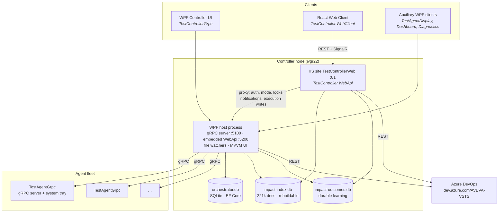
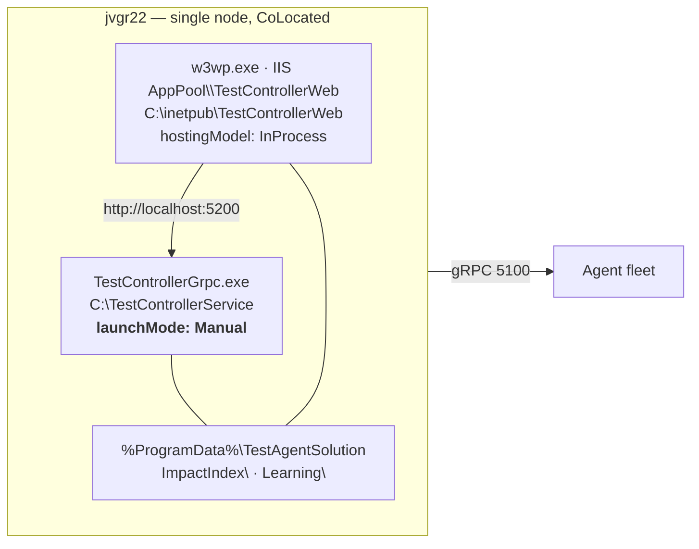
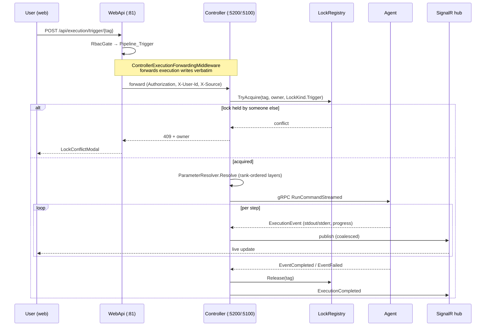
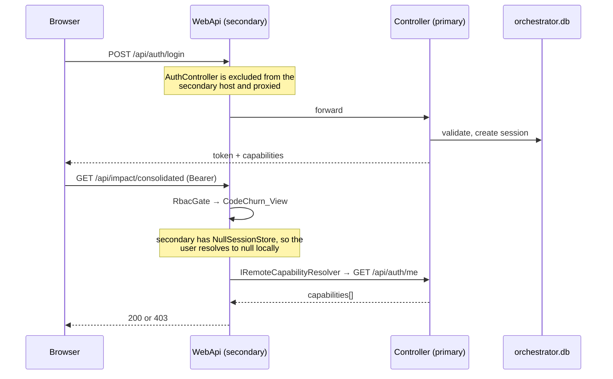
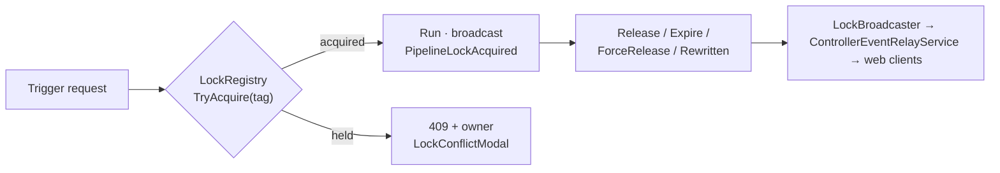
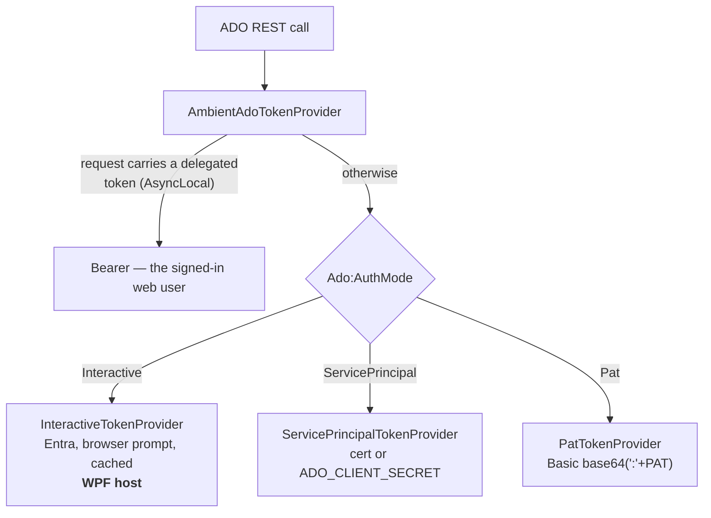
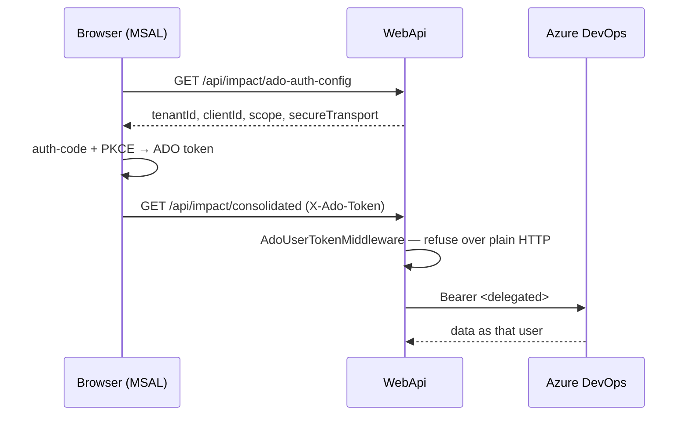
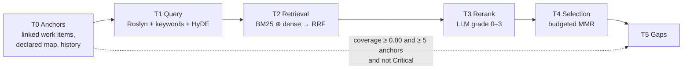
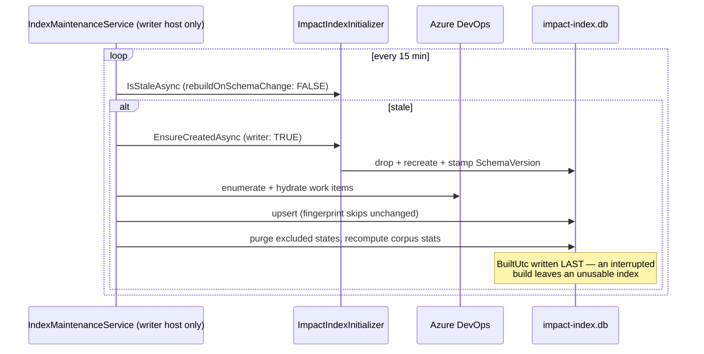
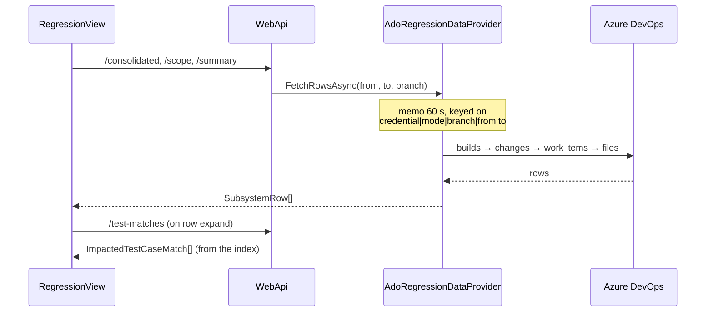

# TestAgentSolution — System Design

**Status:** current as of 2026-09-10. Supersedes the diagrams in `docs/ARCHITECTURE-DIAGRAMS.md`,
`docs/ARCHITECTURE.md` and `docs/ARCHITECTURE_DESIGN_DOCUMENT.md`, all of which were last revised 2026-06-27 and
predate the RBAC phases 3–10, the impact-analysis engine and the Azure DevOps credential work.

Companion documents: `docs/architecture/CURRENT_STATE.md` (types, DI registrations, load-bearing weirdness),
`docs/architecture/CONVENTIONS.md` (coding patterns), `docs/impact/Algorithm-Schema.md` (retrieval maths).

---

## 1. What the system is

A distributed test-orchestration platform for AVEVA System Platform QA. It watches for build drops, runs
multi-step pipelines across a fleet of Windows agent machines, streams live progress to two different UIs, and
tells engineers which test cases a given code change puts at risk.

Two facts shape almost every design decision:

1. **Two front doors, one engine.** A WPF desktop application and a React web client are both first-class. They
   do not share a process, and each host owns its own DI container.
2. **The desktop host is the authority.** It owns the orchestrator database, the session store and the lock
   registry. The web host is a secondary that proxies to it for anything stateful.

---

## 2. Container view

**Shared libraries.** `TestControllerGrpc.Core` holds proto-generated types, domain models, service interfaces
and `IAppLogger`. `TestController.Api` holds controllers, SignalR hubs and middleware, and is referenced by
*both* hosts — which is why a change there ships to two processes. `TestController.Impact` holds the
impact engine; `TestController.Persistence` holds EF Core and migrations.

---

## 3. Deployment topology

Consequences that bite in practice:

- The controller is **manually launched**. No script can start it; a deploy leaves ports 5100/5200 closed until
  a human starts it on the desktop.
- **When the controller is down the web client degrades to Default/Observer**, because `/api/system/mode` and
  `/api/auth/me` are proxied to it. This looks like a broken deployment and is not one.
- Both processes touch the machine-wide impact index. The **single-writer rule** (only the WebApi registers
  `IndexMaintenanceService`) exists to keep them from fighting over it.
- The WPF process runs **two DI containers** — its own and the embedded WebApi's. Startup diagnostics therefore
  appear twice, and singletons are not shared between them.

---

## 4. Execution: trigger to result

**Parameter resolution is by rank, not by order** (`ParameterRank`): Global 10 < ParameterFile/Profile 20 <
PipelinePin 30 < TriggerFile 40 < RunOverride 50. Equal rank overwrites, so successive Initialize nodes behave
as authors expect. Every trigger path funnels through `ExecuteEventTrackedAsync`, which stamps
`ctx.WatchItemTag` — without it the per-pipeline layer silently never matches.

---

## 5. Identity and authorisation

Two independent axes, frequently confused:

| Axis | Question | Mechanism |
|---|---|---|
| **User → our API** | who is calling us? | `AddMultiIdentitySecurity()` (NTLM/Negotiate, API key, roles) + RBAC session tokens |
| **Us → Azure DevOps** | what credential do we present to ADO? | `IAdoTokenProvider` (§7) |

`RbacGate` used to short-circuit to 403 whenever the local user was null, which 403'd **every** gated endpoint
on the standalone WebApi including for administrators. `IRemoteCapabilityResolver` exists to close that hole
without failing open.

**Modes.** Default mode fails open (WPF allowed, web read-only); Secured mode enforces `CanAsync`. Four
permission catalogs must stay in sync — the `Permission` enum, `AuthorizationService` buckets,
`PermissionCatalog`, and the TypeScript mirror in `capabilities.ts`.

---

## 6. Pipeline locking

> **Known defect — split-brain registry.** `LockRegistry` is an in-memory singleton and there are two
> processes. The WebApi registers its own instance, but `LocksController` is proxied to the controller. A
> **web-originated lock therefore lives only in w3wp**: it broadcasts live, but vanishes on reconnect resync, is
> invisible to WPF clients, and cannot be force-released. WPF-originated locks behave correctly. Unfixed.

This is a different layer from `AgentLockManager`, which locks agent *machines* per execution session.

---

## 7. Azure DevOps credentials

The single most operationally troublesome area, so it is worth stating precisely.

`AmbientAdoTokenProvider` wraps the configured provider and prefers a per-request delegated token carried in an
`AsyncLocal`. That keeps `Core` free of an ASP.NET dependency and — critically — required **no lifetime changes**
to the ADO graph, which is singleton from `AdoClient` upward. Background work with no request context (index
maintenance) transparently keeps using the host credential.

**Security invariants.**
- The delegated token uses `X-Ado-Token`, never `Authorization` — that header already carries our own session token.
- The header is **refused on a plaintext connection** (`Ado:RequireSecureUserToken`, default true): it is an
  organisation-wide bearer credential.
- `AdoRegressionDataProvider`'s 60-second memo key **leads with a credential fingerprint** (SHA-256 prefix, never
  the token). Without it, per-user credentials would serve one user's ADO results to another.

**Diagnostic ladder** for any ADO 401/403, run from the failing host, emitting only status codes:

| Rung | Endpoint | A failure here means |
|---|---|---|
| 1 | `app.vssps.visualstudio.com/_apis/profile/profiles/me` | the token itself is invalid — nothing else matters |
| 2 | `dev.azure.com/{org}/_apis/connectionData` | token valid but not for this org, or blocked by policy |
| 3 | `dev.azure.com/{org}/{project}/_apis/wit/fields` | genuine project-permission problem |

401 means *not authenticated*; 403 means *authenticated but not authorised*. They have different fixes.

---

## 8. Impact analysis

Answers "which test cases does this change put at risk?" Six tiers:

Tunables: BM25 `k1=1.2 b=0.75`, RRF `K=60`, MMR `λ=0.70`, tier budgets Smoke 15 m / Targeted 90 m / Full ∞.
Risk score `R = 0.30Ĉ + 0.25B̂ + 0.20F + 0.15T̂ + 0.10U`; Critical ≥ 0.70, High ≥ 0.45.

**Degradations that look like bugs:** with no embedding endpoint the dense leg is inert *and MMR diversity
silently does nothing*; with no LLM the reranker grades everything 2/0.5, so every retrieval hit reports as
"partial".

### Index lifecycle

> **Incident, 2026-09-10.** Bumping `CurrentSchemaVersion` to 2 while `IsStaleAsync` passed
> `rebuildOnSchemaChange: true` meant a routine *read-only staleness check* dropped 270,130 documents and left
> the index empty, because the follow-on rebuild then failed on ADO auth. Fixed in `537e5d4`: readers pass
> `false` and tolerate a stale index; only writers drop. **A read path must never be able to destroy data.**

---

## 9. Code churn (regression scope)

Distinct from impact analysis and frequently conflated with it:

| Surface | Source | Needs a live ADO credential? |
|---|---|---|
| Code churn grid — components, changes, PRs, work items, files | `ComponentChangeCollector` per request | **Yes** |
| Impacted Test Cases (row expand) | impact index | No |

This is why rebuilding the index does nothing for a web client whose ADO credential is dead: the grid never
produces rows to expand.

---

## 10. Data stores

| Store | Owner | Durability |
|---|---|---|
| `orchestrator.db` | controller | **durable** — users, sessions, assignments, audit, maintenance ops |
| `impact-index.db` | WebApi (single writer) | **rebuildable** cache, ~1.3 GB, WAL |
| `impact-outcomes.db` | every host | **durable** — ranker learning; merged as an idempotent set union |
| `WatchList.xml` | controller | **durable** — pipeline definitions, hot-reloaded by a file watcher |

`WatchItem.Tag` is an identity key: it is the `PipelineId` in `PipelineAssignments` and appears in
`AuditEntries.ResourceId`. **Renaming a tag orphans every assignment.** Characters matter too — a `+` in a tag
made every tag-in-path endpoint 404 at IIS before ASP.NET ever saw it.

---

## 11. Cross-cutting

- **Logging** is the custom `IAppLogger` (`_logger.Info("Category", "message")`), not Serilog. `ILogger<T>` is
  reserved for framework-level hosted services — which is why some components appear in stdout logs and others
  never do.
- **DI defaults to Singleton.** Only `OrchestratorDbContext` is Scoped, accessed from singletons via
  `IDbContextFactory`.
- **UI state**: CommunityToolkit.Mvvm source generators in WPF; one Zustand store per domain in React; all HTTP
  through the `apiFetch<T>()` wrapper.
- **Audit writes are fire-and-forget** through `IAuditWriter`, never awaited in a request path.

---

## 12. Known gaps

| Gap | Impact |
|---|---|
| Split-brain `LockRegistry` | web-originated locks are invisible to WPF and cannot be force-released |
| Web tier has no working ADO credential | code churn is dead on the web client; PATs appear blocked org-wide |
| Site is plain HTTP on port 81 | blocks delegated ADO sign-in, which refuses to send a token in the clear |
| MMR diversity inert without embeddings | selection is less diverse than the design implies |
| `Ado.IncludedAreaPaths` declared but unused | configuration that silently does nothing |
| `compare` / `train` verbs in ImpactEval | stubs |
