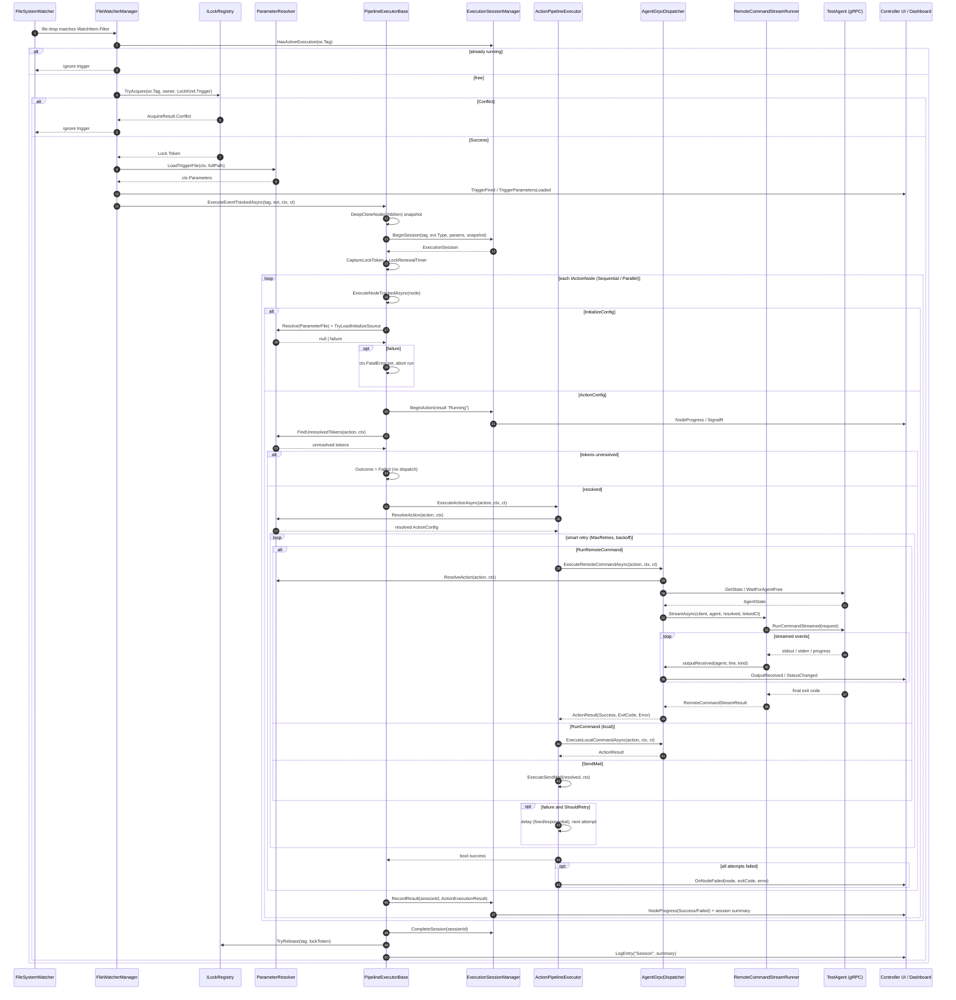

# Pipeline Trigger Sequence

How a WatchList file drop becomes an agent command and how results flow back.

Traced from:

- `TestControllerGrpc/Services/FileWatcherManager.cs` — `OnTriggered`
- `TestControllerGrpc.Core/Services/PipelineExecutorBase.cs` — `ExecuteEventTrackedAsync`, `ExecuteNodeTrackedAsync`, `ExecuteActionTrackedAsync`, `ExecuteInitialize`
- `TestControllerGrpc/Services/ActionPipelineExecutor.cs` — `ExecuteActionAsync` (smart retry)
- `TestControllerGrpc/Services/AgentGrpcDispatcher.cs` — `ExecuteRemoteCommandAsync`
- `TestControllerGrpc.Core/Services/RemoteCommandStreamRunner.cs` — `StreamAsync`

## Sequence

## Notes

- **Lock ownership is split.** The trigger path acquires the pipeline lock; the executor releases it in `finally` using the token threaded through `PipelineExecutionContext.LockToken`. `LockRenewalTimer` keeps the expiry sweeper from reaping it mid-run. A stale token never releases a newer acquisition's lock.
- **`ParameterResolver` is consulted three times** on the dispatch path: `ExecuteInitialize`, the `FindUnresolvedTokens` pre-flight in `ExecuteActionTrackedAsync`, and `ResolveAction` in both `ActionPipelineExecutor` and `AgentGrpcDispatcher`.
- **An unresolved token is a hard stop, not a dispatch.** Sending `[_Agent2]` literally to a shell fails far from the real cause, so the pre-flight fails the action first. An `Initialize` load failure sets `ctx.FatalError`, which overrides `FailAndContinue`.
- **Results return on two channels:** live streamed lines via `OutputReceived` / `StatusChanged`, and terminal state via `ExecutionSessionManager.BeginAction` / `RecordResult` — the latter carries the `SessionId` the dashboard routes on.
- **Two independent retry layers.** `ActionPipelineExecutor` owns smart retry (`MaxRetries`, fixed/exponential backoff, `RetryOnExitCodes`). `AgentGrpcDispatcher` separately owns the Polly resilience pipeline, busy-recovery with `ForceReady`, and the reboot circuit-breaker bypass.
- **Snapshot isolation:** `DeepCloneNode` clones the action tree at session start so a WatchList hot-reload cannot mutate in-flight nodes.
