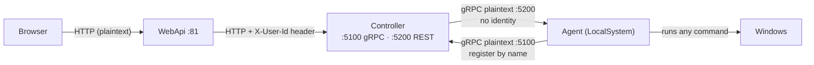
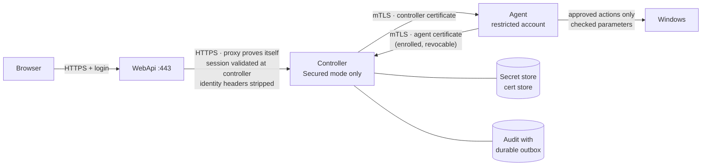
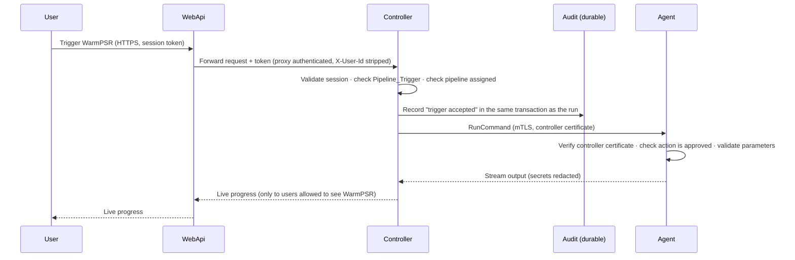

# Security Boundaries — Understanding, System Design and Roadmap

> **Status:** Planned — not part of Release 1.0. Kept in git as a future backlog item.
> **Requirement:** "11 Security boundaries and policy" (sources: S1 §5, E10, E11).
> **Evidence:** `SECURITY-GAPS.md` (Copilot gap assessment, 2026-09).
> **How to use this file:** read §1–§3 to understand the problem, §4 for the design, §5 for the decisions,
> §6–§7 when you are ready to plan work. Each phase in §6 can be picked up on its own.

---

## 1. The problem in plain words

TestController can **run commands, install software and reset machines** across the whole test fleet.
Anything that powerful must be protected like a server room, not like a shared folder.

Today the system is built for a **trusted lab network**: it assumes that anyone who can reach it is allowed
to use it. That was a reasonable starting point. It stops being safe the moment:

- more teams use it,
- the network is less trusted, or
- someone reaches a port directly instead of going through the UI.

The requirement asks for one principle: **every door checks who you are and what you are allowed to do —
on the server side, every time.** Hiding a button in the UI is not a check.

---

## 2. The five doors (boundaries) — explained with a building

Think of TestController as an office building.

| # | Boundary | Building analogy | What must be true |
|---|---|---|---|
| 1 | **User → API** | Front door | Only badge holders enter, over a private channel (HTTPS). Every action checks the badge *and* the permission. |
| 2 | **Web proxy → Controller** | Reception passing visitors upstairs | Upstairs must not trust a sticky note saying "this is the manager". It checks the real badge, or reception proves who it is. |
| 3 | **Controller ↔ Agent** | Head office phoning branch offices | Both sides prove identity with a certificate. A caller who merely *says* "I'm jvgr1" is not trusted. |
| 4 | **Agent → Operating system** | What a branch employee may physically do | Only approved tasks, with checked inputs, in approved folders, under a limited account. |
| 5 | **User → Live data** | Who can read which files | You see runs, logs and results only for pipelines you are assigned to — not by guessing an ID. |

Two cross-cutting rules sit on top of all five doors:

- **Secrets stay locked away** (passwords, tokens, keys) and are **blanked out** in every log, screen and
  error message.
- **Important actions leave a permanent record** (who triggered, cancelled, changed permissions or modes),
  and that record must not be lost if something crashes.

---

## 3. Where we are today (verified)

| Area | Today | Why it matters |
|---|---|---|
| Transport | **Three listeners, all plaintext, all on every network interface**: controller gRPC `:5100`, controller REST/SignalR `:5200`, agent gRPC `:5200`. TLS code exists (`AgentKestrel:EnableTls`, `GrpcTlsChannelFactory`) but ships **off** (`GrpcMode: "Plaintext"`). | Anyone on the network can read traffic and talk to the ports directly. |
| Mode | RBAC has **Default** and **Secured** mode. Default injects a synthetic user with no database checks. | Default mode behaves like "everyone is admin". |
| Proxy | The web tier forwards identity to the controller in headers (`X-User-Id`, `X-Source`). | If headers are trusted, they can be forged. |
| Controller ↔ agent | No machine identity. A node is known by **name and address**. | A machine claiming a name can register as that node. |
| Agent → OS | Agent runs as **LocalSystem** and executes the commands it is sent. | Whoever can send a command gets full control of the machine. |
| Live data | SignalR, logs and results are not scoped per assigned pipeline everywhere. | Users can see runs they do not own. |
| Secrets | Held in config files and environment variables (SMTP, ADO PAT, vCloud). `SecurityRedactor` covers agent command lines only. | Secrets can leak into stdout, error bodies or broadcasts. |
| Audit | **Fire-and-forget** queue (`IAuditWriter`). | A crash can lose the record of a critical action. |
| Permissions | Permission lists are defined in **four places** that drift apart. | UI and server can disagree about what a role may do. |

**Fair context:** none of this was a mistake for a lab tool on a trusted network. It is simply the gap
between "lab tool" and "production system that can change a fleet".

---

## 4. System design

### 4.1 Today

### 4.2 Target

### 4.3 A secured "Trigger pipeline" — step by step

### 4.4 Design rules

1. **Server decides, client only reflects.** Hidden buttons are cosmetic; the server always checks.
2. **Fail closed in production.** Missing authentication, Default mode or unsafe bindings stop the service
   from starting. A development bypass exists only in a local debug build, never in the release package.
3. **Identity is proven, never claimed.** Not a header, not a node name, not a network address.
4. **Authenticated ≠ authorized.** A valid certificate or login still needs permission for the specific action.
5. **One permission definition** generates the server catalog and the TypeScript capability list.
6. **Critical events are durable**; high-volume telemetry may stay asynchronous with overflow counters.

---

## 5. Decisions

| # | Decision | Options | Recommendation | Status |
|---|---|---|---|---|
| D-1 | User identity | App's own accounts · Windows domain (Negotiate) · Entra ID | Own accounts in Secured mode first; **Windows domain login** later (the fleet is already on a domain) | Recommended |
| D-2 | Agent/controller certificates | Company CA auto-enrollment · admin-issued per node · self-signed | Company CA if available, else admin-issued. **Never self-issued.** Enroll during a snapshot refresh | Recommended — deferred |
| D-3 | Audit storage unavailable | Block everything · lose events · durable outbox | **Durable local outbox** for critical events; refuse privilege, mode and force-release changes if they cannot be recorded; triggers and cancels continue | Recommended |
| D-4 | Command policy timing | Enforce now · audit-only then enforce | **Audit-only ~2 weeks**, build the allow-list from real use, then enforce | Recommended |
| D-5 | Who edits WatchLists | Admin only · Admin + Manager · anyone assigned | **Admin + Manager edit; Engineers run only** | Recommended |
| D-6 | Live-data separation | By team · by assigned pipeline | **By assigned pipeline** (reuses existing assignments); Admin sees all | Recommended |
| D-7 | Rollout | Big bang · phased | **Phased** per §6; certificates with the agent snapshot window | Recommended |

Mark a decision **Agreed** in this table when the team signs it off.

---

## 6. Roadmap (phases)

Each phase is independent enough to schedule on its own. Order matters: early phases are cheap and remove the
biggest risks; certificates come last because they touch every node.

### Phase 0 — Prerequisites (no code)
- Confirm a working **Admin account** and that WPF + web logins work in Secured mode (avoid lock-out).
- Back up deployed `appsettings.json` files — the deploy scripts deliberately do not manage them.
- Agree D-1, D-3, D-5, D-6.
- **Exit:** a test environment that runs in Secured mode end to end.

### Phase 1 — Close the live bypasses *(Copilot items A1–A4, B1–B3)*
- Production runs **Secured mode only**; startup refuses Default mode and missing authentication.
- Remove the "anonymous user acts as Admin" behaviour.
- Web tier **strips** incoming `X-User-Id` / `X-Source`; controller does not trust them for authorization or audit.
- **Exit tests:** anonymous request → rejected; forged `X-User-Id` → no change in authorization or audit
  attribution; host with Default mode in production config → refuses to start.
- **Effort:** S–M. **Note:** A1–A4 are live config edits — schedule a quiet window.

### Phase 2 — Authorize every door and every data read
- Permission + resource check on every mutation, export, sensitive read and SignalR subscription.
- Live data (runs, logs, artifacts, impact results) scoped to assigned pipelines (D-6).
- **One permission definition** generating server and TypeScript catalogs (ends the four-way drift).
- **Exit tests:** out-of-scope user cannot trigger, cancel, edit, export or subscribe; guessing a run ID
  returns "not found / forbidden".
- **Effort:** M.

### Phase 3 — Secrets, redaction and durable audit
- Move secrets (SMTP, ADO PAT, vCloud, signing keys) to a protected store accessible only to the hosting account.
- Redaction applied to stdout, error bodies, logs and broadcasts — with tests on each.
- Critical audit events written with the operation or through a **durable outbox** (D-3).
- **Exit tests:** planted fake password never appears in logs, UI, SignalR or error responses; kill the process
  mid-operation → the audit record still exists.
- **Effort:** M.

### Phase 4 — Command policy on the agent
- Approved action types and parameter schemas; controlled working directories; reject path traversal and
  unapproved scripts.
- Start **audit-only** (log what would be blocked), then enforce (D-4).
- Plan moving the agent off LocalSystem to a restricted account where installs allow it.
- **Exit tests:** `..\..\` paths, unexpected arguments and unapproved scripts are rejected in enforce mode;
  all real pipelines still pass.
- **Effort:** M–L.

### Phase 5 — Encrypt the transport
- HTTPS for the browser and the web → controller hop.
- TLS on controller and agent gRPC listeners (the code exists; enable, configure, test).
- Bind listeners to the intended interfaces rather than all interfaces.
- **Exit tests:** plaintext connections refused; certificates validated; no traffic readable on the wire.
- **Effort:** M. **Rule:** controller first, then agents — the same order rule as other wire changes.

### Phase 6 — Machine identity (mTLS) with enrollment and rotation
- Controller and agents each hold a certificate; both sides verify the other.
- Approved **enrollment**, **rotation** before expiry, and **revocation** of a lost or retired node.
- Protect both command dispatch and the register/callback path.
- **Exit tests:** unknown or revoked agent cannot register or receive commands; unknown controller cannot
  command an agent; a node name alone proves nothing.
- **Effort:** L. **Schedule with the agent snapshot refresh** so certificates are baked in once.

---

## 7. Backlog items (ready to copy into Azure DevOps)

| ID | Title | Phase | Priority | Size | Depends on |
|---|---|---|---|---|---|
| SEC-01 | Secured-mode readiness check (admin account, logins, config backup) | 0 | P1 | S | — |
| SEC-02 | Production refuses Default mode / missing auth at startup | 1 | P1 | S | SEC-01 |
| SEC-03 | Remove anonymous-admin behaviour | 1 | P1 | S | SEC-01 |
| SEC-04 | Strip and ignore forged identity headers at proxy and controller | 1 | P1 | S | — |
| SEC-05 | Permission + resource checks on all mutations, exports, sensitive reads | 2 | P1 | M | SEC-02 |
| SEC-06 | Authorize SignalR subscriptions and live data per assigned pipeline | 2 | P1 | M | SEC-05 |
| SEC-07 | Single permission definition generating server + TypeScript catalogs | 2 | P2 | M | — |
| SEC-08 | Move secrets to protected store | 3 | P1 | M | — |
| SEC-09 | Redaction for stdout, error bodies, logs, broadcasts + tests | 3 | P1 | S | — |
| SEC-10 | Durable outbox for critical audit events; defined outage behaviour | 3 | P1 | M | D-3 |
| SEC-11 | Agent command policy — audit-only mode | 4 | P2 | M | — |
| SEC-12 | Agent command policy — enforce with allow-list | 4 | P2 | M | SEC-11 |
| SEC-13 | Agent restricted execution account (feasibility) | 4 | P3 | M | SEC-12 |
| SEC-14 | HTTPS for browser and web → controller | 5 | P2 | M | — |
| SEC-15 | TLS on controller and agent gRPC; bind to intended interfaces | 5 | P2 | M | SEC-14 |
| SEC-16 | mTLS machine identity with enrollment, rotation, revocation | 6 | P2 | L | SEC-15, D-2 |

---

## 8. Verification catalogue (from the requirement)

| Boundary | Proof that it works |
|---|---|
| User → API | Anonymous, revoked and out-of-scope identities cannot trigger, cancel, edit, export or subscribe. |
| Proxy → Controller | Forged `X-User-Id` or `X-Source` cannot change authorization or audit attribution. |
| Controller ↔ Agent | An unknown or revoked agent/controller identity cannot issue commands or impersonate a node. |
| Agent → OS | Path traversal, unexpected arguments and unapproved scripts are rejected. |
| User → Live data | A user cannot join another pipeline's run or read its data by guessing an ID. |
| Secrets | A planted secret never appears in logs, stdout, error bodies, UI or broadcasts. |
| Audit | Critical events survive a crash; behaviour during audit-store outage matches D-3. |

---

## 9. Traps to remember

1. **Lock-out.** Switching to Secured mode without a working Admin login locks you out. Do Phase 0 first.
2. **Mode switch needs a restart** — DI registration differs between Default and Secured.
3. **Config files are not deployed by the scripts.** Security settings live in hand-tuned `appsettings.json`
   on the live hosts; change them deliberately and back them up.
4. **Wire changes go controller first, agents second** — the same rule that protected the update-posture release.
5. **Certificates expire.** Rotation must be automated or calendared, or the fleet stops talking on expiry day.
6. **Audit-only before enforce.** Enforcing a command allow-list on day one will break real pipelines.

---

## 10. Glossary (plain words)

| Term | Meaning |
|---|---|
| Authentication | Proving who you are (login, certificate). |
| Authorization | Checking what you are allowed to do, after you are identified. |
| Secured mode | TestController mode where every request is checked against real users and permissions. |
| Default mode | Development-style mode where a synthetic user is assumed; not for production. |
| TLS / HTTPS | Encryption so traffic cannot be read or altered on the network. |
| mTLS | Both sides show a certificate, so each proves its identity to the other. |
| Enrollment | Giving a new machine its certificate through an approved process. |
| Rotation | Replacing certificates before they expire. |
| Revocation | Cancelling a certificate so a lost or retired machine can no longer connect. |
| Redaction | Blanking out secrets before anything is logged or shown. |
| Durable outbox | A local, crash-safe queue so important records are never lost. |
| Allow-list | A list of the only actions or commands that are permitted. |
