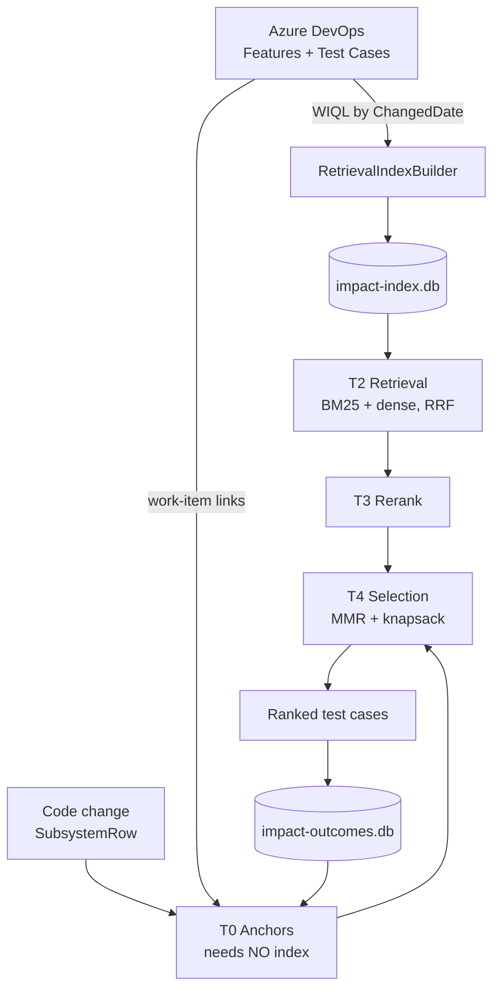

# ImpactDb — Deep Dive

How the impact-mapping engine turns a code change into a ranked list of test cases, why it sometimes
returns nothing, and how to operate it.

Companion docs: [`ImpactMapping-Copilot-BuildGuide.md`](../AzureIntegration/ImpactMapping-Copilot-BuildGuide.md)
(build order) and [`FEATURE-ARCHITECTURE.md`](../AzureIntegration/FEATURE-ARCHITECTURE.md) (ADRs).
This document is the *operational and algorithmic* view.

---

## 1. The one-paragraph version

ImpactDb answers: **"I changed these files — which test cases should I run?"** It pulls the Azure DevOps
corpus (Features and Test Cases) into a local SQLite BM25 index, then for each impacted component runs a
six-tier cascade: deterministic **anchors** from ADO work-item links, hybrid **retrieval** over the index,
optional LLM **rerank**, and a budgeted **selection** step that respects a time budget. Accumulated run
outcomes feed back in as anchors, so it improves with use.

---

## 2. Two databases, on purpose

| Database | Contents | Rebuildable? | Owner |
|---|---|---|---|
| `impact-index.db` | BM25 term postings, doc vectors, corpus stats | **Yes** — regenerate any time | WebApi (single writer) |
| `impact-outcomes.db` | Mapping runs, selections, execution outcomes, escapes | **No** — durable learning | Every host |

Default location: `%ProgramData%\TestAgentSolution\ImpactIndex` and the sibling `...\Learning`.
Resolution order is `IMPACT_INDEX_ROOT` env var → `ImpactMapping:IndexRoot` → the ProgramData default
([`ImpactIndexPathProvider`](../../TestControllerGrpc.Core/Impact/ImpactIndexPathProvider.cs)).

The split is deliberate: a forced index rebuild must never wipe the learning history that trains the ranker.
That is also why `-Force` deletes only the index.

> **Single-writer rule.** `AddImpactMapping(..., ImpactHostRole.ReaderWriter)` is called **only** by
> `TestController.WebApi`. The WPF controller registers as `Reader` and never rebuilds. Two writers against
> one SQLite file is the failure this parameter exists to prevent.

---

## 3. Data flow



The critical property: **T0 anchors need no index.** That path works even when the index is empty.

---

## 4. Index build

`RetrievalIndexBuilder.BuildAsync(fullRebuild, ...)`.

**Corpus is only two work-item types:** `"Feature"` and `"Test Case"`
([`AdoImpactWorkItemClient`](../../TestControllerGrpc.Core/Impact/Ado/AdoImpactWorkItemClient.cs) field arrays).
Bugs, IMS and User Stories are **never indexed** — they enter as anchors instead (§6).

| Document | Id | Text indexed |
|---|---|---|
| Test Case | `TC:<id>` | Title + Description + flattened Steps + Tags |
| Feature | `F:<id>` | Title + Description |

Composition is defined once, in
[`IndexTextComposer`](../../TestControllerGrpc.Core/Impact/IndexTextComposer.cs), and used by both the builder
and the test fixtures — when those drift, a fixture measures a corpus that does not exist. **Description is
included because test case titles are frequently a bare requirement id ("FR 12345")** carrying no matchable
vocabulary; see `Algorithm-Schema.md` §2.

**Enumeration** uses adaptive WIQL date windows because a flat WIQL query throws `VS402337` when it *matches*
more than 20,000 rows (independent of `$top`). Windows start at 180 days, halve on overflow, double when
sparse. `[System.ChangedDate]` has day precision, so boundaries are whole days. A full rebuild passes
`DateTimeOffset.MinValue`, clamped to **1900-01-01** — ADO is SQL-Server backed and rejects pre-1753 dates
with `TF51586`.

**Incremental vs full.** `IndexMaintenanceService` checks every 15 minutes and runs an *incremental* build
when the index is older than `Index.MaxAge` (30 h), resuming from the `IndexedThroughUtc` watermark.
Full rebuilds are manual only (`deploy\Rebuild-ImpactIndex.ps1`).

**Skip-unchanged.** Each document's raw text is SHA-256 fingerprinted; unchanged items are skipped before
tokenization. Postings are inserted in 300-row chunks to stay under SQLite's 999-variable limit.

**Corpus statistics must stay corpus-wide.** Document frequency and average document length are recomputed
across the whole corpus. Scoping them to a query would make IDF drift with the query.

---

## 5. The algorithm, tier by tier

`ImpactTestMappingService.MapCoreAsync`.

### T0 — Anchors (deterministic, no index)

Three sources run in parallel, deduplicated by `(testCaseId, source)` keeping the strongest weight:

| Source | Weight | Meaning |
|---|---|---|
| `LinkedWorkItem` | **1.0** | The change's Bug/IMS/Story links to this test case |
| `HistoricalFailure` | 0.5 – 1.0 | This test caught a regression in this area before |
| `DeclaredMapping` | 0.9 | The component map declares this area/use case |

**Early exit** short-circuits T1–T3 when `coverage >= 0.80` **and** `anchors >= 5`, and never for
`RiskTier.Critical` unless explicitly allowed. This is what makes the pipeline cheap enough to run per pull
request rather than nightly.

### T1 — Query construction

`ChangeDocumentBuilder` extracts changed symbols, string/number literals and public API changes, then
`KeywordExtractor` groups terms into weighted facets:

| Facet | Weight |
|---|---|
| identity (area, subsystem, vob) | 1.00 |
| literals | 0.95 |
| api | 0.85 |
| narrative (PR/commit text) | 0.75 |
| expanded (HyDE) | 0.60 |
| paths:{folder} | 0.30 – 1.00 |

### T2 — Dual-branch retrieval

Two branches run in parallel over kind-scoped snapshots:

- **Branch A** searches Features directly.
- **Branch B** searches Test Cases, then resolves each to its parent Feature (back-reference).

Both legs fuse with **Reciprocal Rank Fusion**:

$$\text{RRF}(d) = \left( \frac{w_{lex}}{K + r_{lex}(d)} + \frac{w_{dense}}{K + r_{dense}(d)} \right) \cdot w_{group}$$

with $K = 60$, both weights 1.0 by default. Ties break on ascending work-item id, so results are
deterministic.

Lexical leg is Okapi BM25 ($k_1 = 1.2$, $b = 0.75$):

$$\text{BM25}(q,d) = \sum_{t \in q} \text{IDF}(t) \cdot \frac{f_{t,d}\,(k_1+1)}{f_{t,d} + k_1\left(1 - b + b\frac{|d|}{\text{avgdl}}\right)}$$

**Fan-out penalty.** A Feature with many children would otherwise dominate. Scores are damped by
$\log(1+\text{median}) / \log(1+\text{childCount})$, clamped to `[0.35, 1.30]`, and features with more than
5× the median child count raise a warning.

**Snapshot loading is term-scoped.** Only documents carrying at least one query term are loaded — BM25 cannot
score a document with no shared term anyway. This is what fixed the `too many SQL variables` failure at
226k test-case documents.

### T3 — Rerank and calibrate

`LlmRelevanceReranker` grades each candidate 0–3 with cited signals, cached 7 days on
`SHA256(fingerprint + id + revision)`. Borderline grades (1–2) get extra passes and the median is kept.
**It fails open**: a parse error becomes grade 2 / confidence 0.5 rather than dropping the candidate.

Score calibration is identity (`Linear`) unless a fitted isotonic/ranker model is configured.

### T4 — Budgeted selection

`BudgetedDiversitySelector` scores each candidate:

$$0.45\,\hat{r} + 0.25\,\hat{f} + 0.20\,g + 0.10\,\phi + 0.05\,a$$

where $\hat r$ = normalised retrieval score, $\hat f$ = best parent-feature score, $g$ = rerank grade,
$\phi$ = historical failure rate, $a$ = 1 if automated. Then:

1. drop grade-0 noise
2. **MMR** diversity: $\lambda \cdot rel(c) - (1-\lambda)\max sim(c, S)$, $\lambda = 0.70$
3. greedy value/cost knapsack against the tier budget (Smoke 15 min, Targeted 90 min, Full ∞)
4. **recall safety net** — anchors, top historical failures, grade-3 selections and one test per selected
   feature bypass the budget entirely

### T5 — Gap detection

`CoverageGapDetector` surfaces uncovered regression areas, orphan features, evidence-free selections and
under-resourced high-risk areas. Gaps are reported, never silently logged away.

---

## 6. Work item → test case linkage

This is the part reviewers care about most: *why is this test in my list?*

`AnchorEdgeProvider.GetLinkedWorkItemEdgesAsync` takes the change's linked work-item ids and calls
`GetChildTestCasesAsync`, which issues a `WorkItemLinks` WIQL query over **both**:

- `System.LinkTypes.Hierarchy-Forward` (parent → child)
- `Microsoft.VSTS.Common.TestedBy-Forward` (requirement → test case)

Targets are then filtered to `System.WorkItemType = 'Test Case'`. So a Bug with a **Tested By** link to a
test case *is* resolved, with weight 1.0.

Each resulting `ImpactedTestCaseMatch` now carries `LinkedWorkItems` — the Bug/IMS/User Story that put it in
scope — surfaced as "Verifies:" in the web grid and as a **Linked Work Items** column on the *Impacted Test
Cases* sheet of the churn workbook.

> **Depth follows `Ado.LinkWalkMaxDepth`** (default 3). The walk is breadth-first and attributes a target to
> every root that reaches it, so a test case linked to a Task *underneath* a Bug is credited to the Bug.

---

## 7. Caching

| Cache | Key | Invalidation |
|---|---|---|
| Per-kind document table | `IndexKind` | index `BuiltUtc` changes |
| Embedding vectors | `modelId:SHA256(text)` | model id change |
| LLM rerank judgements | `SHA256(fingerprint+id+rev)` | 7-day TTL |
| HyDE expansions | `SHA256(fingerprint)` | 30-day TTL |
| Index health | file size + mtime | 60-second TTL |

The health cache matters: `PRAGMA integrity_check` took **95 seconds** on a 1.29 GB index, so the check uses
`quick_check(1)` plus this cache (≈194 ms cold, 5 ms warm). Every index read is gated on it.

---

## 8. Degradation modes that look like bugs

| Condition | Effect | Is it broken? |
|---|---|---|
| `EmbeddingEndpoint` empty | Dense leg inert **and MMR diversity disabled** | No — BM25-only is supported |
| `LlmModel` empty | All retrieval hits graded 2 → `MatchType` always `"partial"` | No — only anchors reach grade 3 = `"full"` |
| No anchors | Everything is `MappingConfidence.Assumed` | No — text-match only |
| Index empty/missing | Retrieval yields nothing | See §9 |
| Component map absent | Falls back to `NullDeclaredMappingSource` | No — degrades cleanly |

**Config declared but not implemented:** `Ado.IncludedAreaPaths`.

---

## 9. Failure modes and how to diagnose

### The index is empty

`RetrievalIndexStore.GetSnapshotAsync` **throws** `ImpactIndexUnavailableException` when health is
Missing/Empty/Corrupt — deliberately loud, because "no impacted tests" and "the index is broken" must never
look the same to a recall-biased selector.

The engine now catches this **when anchors exist** and answers from anchors alone, so linked Bug/IMS/Story
test cases still surface during an index outage. With no anchors it still throws.

### Health endpoint returns HTTP 503

`GET /health/impact-index` is anonymous but follows the ASP.NET health-check convention: **Unhealthy → 503**.
PowerShell 5.1 `Invoke-WebRequest` throws on 503, so read the body explicitly or you will misread a working
endpoint as a dead site:

```powershell
try { (Invoke-WebRequest 'http://JVGR22:81/health/impact-index' -UseBasicParsing).Content }
catch { $s=$_.Exception.Response.GetResponseStream(); (New-Object IO.StreamReader($s)).ReadToEnd() }
```

### Rebuild "accepted (202)" then nothing happens

The rebuild endpoint is **fire-and-forget**. A failed background build is indistinguishable from a slow one:
the POST still returns 202 and `BuiltUtc` simply never advances.

**Always verify by file growth**, not by the poller:

```powershell
Invoke-Command -ComputerName JVGR22 -ScriptBlock {
  (Get-Item 'C:\ProgramData\TestAgentSolution\ImpactIndex\impact-index.db') |
    Select-Object Length, LastWriteTime }
```

If it is not growing, read the WebApi stdout log:
`C:\inetpub\TestControllerWeb\logs\stdout_*.log` — look for `RetrievalIndexBuilder` / `AdoApiException`.

`Rebuild-ImpactIndex.ps1` now pre-flights the host's live ADO credential via `/api/impact/health` and aborts
with exit code **3** before starting the poll.

### ADO 401

The most common real cause of "no results". The PAT is read from `ADO_PAT` **on the host process**.

- For the IIS-hosted WebApi it must be **Machine** scope — a User-scope `setx` is invisible to the app pool.
- `w3wp` captures environment at process start, so an `iisreset` is required after changing it.

Verify without printing the secret:

```powershell
Invoke-Command -ComputerName JVGR22 -ScriptBlock {
  $pat=[Environment]::GetEnvironmentVariable('ADO_PAT','Machine')
  $h=@{Authorization='Basic '+[Convert]::ToBase64String([Text.Encoding]::ASCII.GetBytes(":$pat"))}
  try { "ADO $((Invoke-WebRequest 'https://dev.azure.com/AVEVA-VSTS/_apis/projects?api-version=7.1&$top=1' -Headers $h -UseBasicParsing).StatusCode) VALID" }
  catch { "ADO $([int]$_.Exception.Response.StatusCode) REJECTED" } }
```

---

## 10. Operations

### Topology

| Component | Host | Port | Role |
|---|---|---|---|
| WebApi + React SPA | IIS site `TestControllerWeb` | **81** | index **ReaderWriter** |
| WPF controller | `TestControllerGrpc.exe` | 5200 | index **Reader**, owns the DB |

`/api/impact-mapping/*` is mapped **only** on the WebApi. The controller on 5200 does not have it.

### Rebuild the index

```powershell
.\deploy\Rebuild-ImpactIndex.ps1 -BaseUrl http://JVGR22:81
```

Add `-Force` only to discard a corrupt index — it deletes the `.db` plus `-wal`/`-shm` sidecars and will fail
if the file is locked by a running host. Requires the **Admin** policy.

### Storage permissions

The IIS app pool runs as `ApplicationPoolIdentity`, so the writer is `IIS AppPool\TestControllerWeb`:

```powershell
.\deploy\Prepare-ImpactIndexStorage.ps1 -ServiceAccount "IIS AppPool\TestControllerWeb"
```

The script's default service account is *not* the app pool identity — pass it explicitly.

### Deploy ordering

Deploying the web tier restarts IIS and **kills an in-flight rebuild**. Deploy first, rebuild second.

---

## 11. Verified production reference (2026-09-07, jvgr22)

| Metric | Value |
|---|---|
| Documents after rebuild | 60,400 and climbing |
| Index size | ~375 MB |
| Components loaded | 35 |
| Historical full corpus | 269,134 docs / 1.29 GB (42,521 Feature + 226,613 Test Case) |
| Fan-out timing after tuning | 35 components in ~3.6 s |
| TestCase snapshot load | ~18.5 s cold, ~220 ms BM25 top-50 |

---

## 12. Known gaps

1. **Suite id → runnable test** is partly resolved — see `Regression-Selection-Algorithm.md` §4. Automated
   cases now carry `AutomatedTestName`; manual suites remain advisory.
2. **Declared mapping needs the index** — the component map holds prose and UC/US/FR tokens, never ADO ids,
   so declared edges resolve to nothing until the index is built.
3. **No performance baseline test** for a 100k+ corpus.
4. **stdout logging is uncapped** in the generated `web.config`
   (`stdoutLogEnabled="true"`) — a 170 MB log was observed in production.
5. **`Ado.IncludedAreaPaths` is ignored** — the corpus is not area-scoped.
