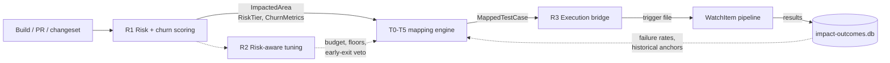
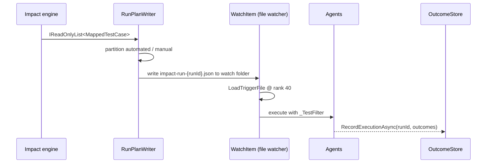

# Regression Selection Algorithm

Status: **IMPLEMENTED, DISABLED BY DEFAULT.** Extends `ImpactDb-Deep-Dive.md`.
R1 is always on. R2 is gated by `ImpactMapping:Risk:EnableRiskWeighting`, R3 by
`ImpactMapping:Selection:EmitRunManifest` — both default false.

## 1. Scope

`ImpactDb-Deep-Dive.md` specifies tiers T0–T5: given an `ImpactedArea` and a `ChangePayload`, produce a
ranked, budgeted set of `MappedTestCase`. That engine exists and works.

This document specifies the two ends that did not exist, plus the risk coupling between them:

| Stage | Name | Before | Now |
| --- | --- | --- | --- |
| **R1** | Churn → `ImpactedArea` (risk + churn model) | constant `RiskTier.Medium`, churn zeros | `RegressionRiskScorer` |
| T0–T5 | Anchors → Retrieval → Rerank → Selection → Gaps | implemented | unchanged |
| **R2** | Risk-aware selection tuning | risk never read | budget multiplier + selection floor |
| **R3** | Selection → executable run | missing entirely | `RunPlanWriter` |



The feedback edge from `impact-outcomes.db` back into T0 already exists (`IOutcomeStore`). R3 is what closes
the loop — until selections are actually executed, `RecordExecutionAsync` is never called with real data and
the learning store only ever sees selections, never outcomes.

---

## 2. R1 — Churn to impacted area

### 2.1 Why the previous input was unusable

`RegressionImpactMatcher.ToImpactedArea` used to build:

```csharp
var churn = new ChurnMetrics(
    LinesAdded: 0, LinesDeleted: 0, FilesTouched: row.TotalFilesModified,
    CommitCount: row.Changes.Count, DistinctAuthorCount: 0, LastChangedUtc: last);
```

Three of six metrics were hardcoded zero and `RiskTier` was the literal `RiskTier.Medium`, so two safety rules
could never fire: the Critical early-exit veto in `AnchorEdgeProvider` and the High/Critical minimum-coverage
gap in `CoverageGapDetector`. `SubsystemRow.RiskTier` is a `string` carrying `build.Result` — it holds
`"succeeded"`, not a risk level, so it cannot be mapped. It is still the value rendered in the grid's "Risk"
column; the engine's tier is computed separately by `IRegressionRiskScorer` and is not surfaced there yet.

### 2.2 Signals

All available per `SubsystemRow` without new ADO calls except where noted.

| Symbol | Signal | Source |
| --- | --- | --- |
| $f$ | files touched | `TotalFilesModified` |
| $k$ | change count | `Changes.Count` |
| $b$ | linked defects | `Changes[].WorkItems` where `Kind == Bug` |
| $m$ | linked incidents | `Changes[].WorkItems` where `Kind == Ims` |
| $\Delta t$ | days since last change | `now - Changes.Max(ObservedUtc)` |
| $F$ | build failed | `BuildResult != "succeeded"` |
| $U$ | coverage uncertainty | `RegressionAreas` empty **or** `Category == Unclassified` |
| $a$ | distinct authors | **requires a new field** — see §2.6 |

### 2.3 Component scores

Churn magnitude is log-compressed; file counts per component are heavy-tailed and a linear term lets one
sweeping rename dominate an entire build.

$$\hat{C} = \min\!\left(1,\ \frac{\log(1+f) + \log(1+k)}{\log(1+f_{\text{ref}}) + \log(1+k_{\text{ref}})}\right)$$

with $f_{\text{ref}} = 40$, $k_{\text{ref}} = 10$ (configurable).

Defect density saturates — the tenth linked bug does not mean more than the fourth. Incidents count double
because an IMS is a customer-observed escape, which is the exact failure mode regression exists to prevent.

$$\hat{B} = \min\!\left(1,\ \frac{b + 2m}{\beta}\right), \quad \beta = 4$$

Recency decays exponentially; a component last touched a fortnight ago carries less risk into today's build
than one touched this morning.

$$\hat{T} = 2^{-\Delta t / h}, \quad h = 7 \text{ days}$$

Combined:

$$R = 0.30\,\hat{C} \;+\; 0.25\,\hat{B} \;+\; 0.20\,F \;+\; 0.15\,\hat{T} \;+\; 0.10\,U$$

Weights are a convex combination, so $R \in [0,1]$.

$U$ is deliberately **additive risk, not reduced risk**. An area we cannot map is more dangerous to under-test
than one we can, because no declared mapping means T0 anchors will be thin and selection falls back to
retrieval alone.

### 2.4 Banding

$$\text{tier}(R) = \begin{cases}
\text{Critical} & R \ge 0.70 \\
\text{High} & 0.45 \le R < 0.70 \\
\text{Medium} & R < 0.45
\end{cases}$$

**The scorer never emits `RiskTier.Unmapped`.** The enum is ordered `{ Unmapped, Medium, High, Critical }`,
and both consumers treat `Unmapped` as *below* Medium:

- `AnchorEdgeProvider` vetoes early exit only for `Critical`.
- `CoverageGapDetector` applies the minimum-selection rule only to `High` and `Critical`.

So emitting `Unmapped` for a poorly-understood area would give the least-understood components the weakest
safety treatment — precisely backwards. Uncertainty is instead routed through the $U$ term, which pushes such
areas *up* the bands. `Unmapped` stays reserved for its existing meaning: a value nobody has computed.

### 2.5 Worked example

A component with 60 files across 12 changes, 1 linked bug, no incidents, last touched 2 days ago, on a failed
build, with declared regression areas present:

$$\hat{C} = \min\!\left(1, \tfrac{\log 61 + \log 13}{\log 41 + \log 11}\right) = \min(1, \tfrac{4.111 + 2.565}{3.714 + 2.398}) = 1.0$$
$$\hat{B} = \tfrac{1 + 0}{4} = 0.25, \quad \hat{T} = 2^{-2/7} = 0.820, \quad F = 1, \quad U = 0$$
$$R = 0.30(1.0) + 0.25(0.25) + 0.20(1) + 0.15(0.820) + 0.10(0) = 0.685 \Rightarrow \textbf{High}$$

A quiet component — 3 files, 1 change, no defects, 20 days old, green build, no declared areas:

$$\hat{C} = \tfrac{1.386 + 0.693}{6.112} = 0.340, \quad \hat{B} = 0, \quad \hat{T} = 2^{-20/7} = 0.138, \quad F = 0, \quad U = 1$$
$$R = 0.30(0.340) + 0 + 0 + 0.15(0.138) + 0.10(1) = 0.223 \Rightarrow \textbf{Medium}$$

The floor is Medium by construction, which is the safe default for a recall-biased selector.

### 2.6 Distinct authors — deferred

`RegressionChangeRef` has no author field, so $a$ cannot be computed without extending the record and the
ADO collector. Author dispersion is a well-established defect predictor, but it is a separate ingest change.
`DistinctAuthorCount` stays 0 and carries **weight 0** until then; it is not silently folded into another term.

---

## 3. R2 — Risk-aware selection tuning

Risk must change what the selector does, or computing it is theatre.

### 3.1 Budget multiplier

`SelectionOptions.TierBudgets` maps `SelectionTier` → budget. Risk scales it:

$$\text{budget} = \text{TierBudgets}[\text{tier}] \times \mu(\text{risk}), \quad
\mu = \begin{cases} 1.50 & \text{Critical} \\ 1.25 & \text{High} \\ 1.00 & \text{otherwise} \end{cases}$$

`SelectionTier.Full` is `TimeSpan.MaxValue`; multiplication must be skipped for it to avoid overflow.

### 3.2 Safety-net floor

`BudgetedDiversitySelector.SafetyNet` currently admits linked-work-item anchors, the top 3 historical
failures, grade-3 judgements and one test per feature. Add a risk-scaled **minimum selection count** — if the
final set is smaller, promote the highest-scoring dropped candidates until it is met:

| Risk | Minimum selections |
| --- | --- |
| Critical | 8 |
| High | 5 |
| Medium | 3 |

3 for Medium matches `CoverageGapDetector.HighRiskMinimumSelections`, so the detector stops reporting a gap
the selector is now capable of closing itself.

### 3.3 Early exit

Already implemented and already correct — `AnchorEdgeProvider` refuses early exit for `Critical` unless
`Anchors.AllowEarlyExitForCriticalTier`. It simply never fires today. R1 activates it at no code cost.

### 3.4 What is deliberately not changed

The T4 scoring weights ($0.45$ retrieval, $0.25$ feature, $0.20$ grade, $0.10$ failure, $0.05$ automation)
stay as they are. They rank test cases *within* an area; risk is a property *of* the area and is constant
across every candidate in one run, so folding it into the per-candidate score would shift every score by the
same constant and change no ordering whatsoever. Risk belongs in budget and floors — quantities that decide
*how many*, not *which*.

---

## 4. R3 — Execution bridge

### 4.1 The gap

The engine returns ADO test-case IDs. Execution is driven by `WatchItem` file-system events. Nothing joins
them, so every recommendation is advisory and `IOutcomeStore.RecordExecutionAsync` never receives real
results.

### 4.2 Linkage already present in ADO

A Test Case work item carries `Microsoft.VSTS.TCM.AutomationStatus` (already projected onto
`TestCaseCandidate.AutomationStatus`) and, when automated, `AutomatedTestName` and `AutomatedTestStorage`.
Those two fields are the join key to a runnable test. They must be added to `TestCaseCandidate` and indexed.

### 4.3 Design: emit a trigger file, reuse the pipeline

Do **not** add a second execution path. The controller already watches folders, fires `WatchItem` events, and
resolves parameters in rank order, where `TriggerFile` (rank 40) outranks `ParameterFile` (20) and
`PipelinePin` (30). A selection is therefore expressible as a trigger file:



Manifest, written into the watched folder as a layered-config-shaped JSON so the existing loader reads it
unchanged:

```json
{
  "version": 1,
  "global": {
    "_ImpactRunId": "3f2a…",
    "_ImpactAreaId": "AAMxCore",
    "_ImpactRiskTier": "High",
    "_TestCaseIds": "418823,418901,419077",
    "_TestFilter": "FullyQualifiedName~Galaxy.Deploy|FullyQualifiedName~Galaxy.Sync",
    "_SelectedCount": "37",
    "_ManualCount": "4"
  }
}
```

`_TestFilter` is built from `AutomatedTestName` values in VSTest `--filter` syntax, chunked so no single
filter string exceeds the command-line limit. Manual test cases are excluded from the filter and reported
separately — they cannot be executed and must not silently inflate the run's apparent coverage.

`_ImpactRunId` is the join key that lets the pipeline's completion handler call `RecordExecutionAsync` against
the originating run.

### 4.4 Constraints this must respect

- **No new writer may append CSV to a `.json` file.** That defect took production down twice; `SaveParameterFile`
  now throws on `.json`. The manifest is written whole via `JsonSerializer`, never appended to.
- **Write-then-rename.** A watcher can observe a partially written file. Write to `.tmp`, then `File.Move`, so
  the watcher only ever sees a complete manifest. `WatchItem` events already support `Renamed`.
- **App-generated UUIDs**, lowercase hyphenated, per repo convention.
- **The manifest is not a parameter file.** It is a trigger file; it must not be edited by the WPF parameter
  grid, and the grid's `.json` guard already prevents that.

### 4.5 Mapping table for unautomated cases

Manual test cases have no `AutomatedTestName`. They are emitted into the manifest as `_ManualTestCaseIds` for
display only, and counted in `CoverageGap` reporting. There is no attempt to guess a runnable target for them.

---

## 5. Metrics

`EvalMetrics` already provides `RecallAtK`, `PrecisionAtK`, `IsSafeRecall` and `Apfd`. The regression-specific
exit criteria:

| Metric | Definition | Target |
| --- | --- | --- |
| Safe recall | fraction of runs where every test that failed was selected | $\ge 0.98$ |
| Selection cost | selected runtime ÷ full-suite runtime | $\le 0.35$ at Targeted |
| APFD | average percentage of faults detected over the ordering | $\ge 0.80$ |
| Escape rate | field escapes ÷ runs, from `EscapeRecord` | non-increasing |

Safe recall is the only hard gate. A regression selector that is cheap and wrong is worse than no selector,
because it manufactures false confidence.

`TestController.ImpactEval`'s `replay` and `compare` verbs measure all four; `compare` gives the paired delta
between the current constant-Medium behaviour and R1+R2, which is the evidence needed before enabling risk
scoring in production.

---

## 6. Rollout

| Phase | Change | Status |
| --- | --- | --- |
| 1 | R1 scorer + `ChurnMetrics` population; tier now real, logged per component | **done** |
| 2 | R2 budget/floors behind `Risk.EnableRiskWeighting` | **done, flag off** |
| 3 | `compare` run; enable flag if safe recall holds and cost target met | pending |
| 4 | R3 manifest writer behind `Selection.EmitRunManifest` | **done, flag off** |
| 5 | Wire pipeline completion → `RecordExecutionAsync` | **not started** |

Phases 1–3 change no execution behaviour, only selection breadth. Phase 4 is the first phase that can
trigger a pipeline, and it stays off until a manifest has been inspected by hand. Phase 5 is what actually
closes the learning loop: until it lands, `impact-outcomes.db` records selections but never results, so
`GetFailureRatesAsync` returns nothing and the historical-failure anchor stays empty.

Every phase ships behind a flag defaulted off, because the two production incidents in this codebase both came
from changing config shape and code in different orders. A flag makes the order irrelevant.
